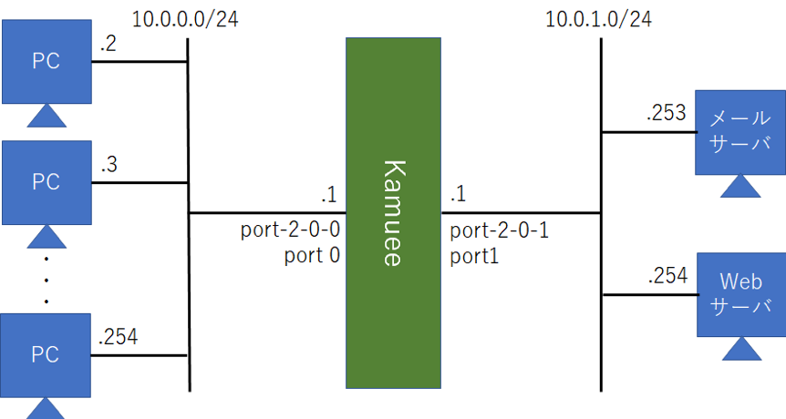

ACL Configration
================

コマンド概要
------------

.. code-block:: text

  kamuee-vty[0]> acl ipv4 policy create 1                      # 1. IPv4ポリシー1を作成します
  kamuee-vty[0]> acl ipv4 policy 1 default-action drop         # 2. IPv4ポリシー1のデフォルトの動作を破棄にします

  # 3. IPv4ポリシー1へ、以下を許可するルール2を作成します
  #   - 発信元アドレス10.0.0.0/24
  #   - 発信元ポート番号1024～65535
  #   - プロトコルTCP
  #   - 送信先アドレス10.0.1.254
  #   - 送信先ポート番号80

  kamuee-vty[0]> acl ipv4 policy 1 rule 2 src 10.0.0.0/24
  kamuee-vty[0]> acl ipv4 policy 1 rule 2 sport 1024 65535
  kamuee-vty[0]> acl ipv4 policy 1 rule 2 proto tcp
  kamuee-vty[0]> acl ipv4 policy 1 rule 2 dst 10.0.1.254
  kamuee-vty[0]> acl ipv4 policy 1 rule 2 dport 80 80
  kamuee-vty[0]> acl ipv4 policy 1 rule 2 action permit

  kamuee-vty[0]> acl ipv4 port 1 out apply-policy 1           # 4. IPv4ポリシー1を物理ポート1から発信するパケットへ適用します
  kamuee-vty[0]> acl commit port 1                            # 5. 物理ポート1のACLを確定します
  kamuee-vty[0]> show acl port 1                              # 6. 物理ポート1へ適用されているポリシーを表示します
  kamuee-vty[0]> show acl ipv4 policy 1                       # 5. IPv4ポリシー1内のルールを表示します

ACL設定例
---------

10.0.0.0/24ネットワーク内にPCが、10.0.1.0/24ネットワーク内にサーバが設置され
ている。10.0.0.1/24ネットワーク内のPCのウェルノウンポート（ポート1024～65535）
から、メールサーバのSMTP（TCPポート25）と、WebサーバのHTTP（TCPポート80）を許可
し、それ以外の通信を拒否するACLを設定し、port1から発信するパケットに適用する。

設定コマンド

.. code-block:: text

  zebra@kamuee(config)# interface port-2-0-0
  zebra@kamuee(config-if)# ip address 10.0.0.1/24
  zebra@kamuee(config)# interface port-2-0-1
  zebra@kamuee(config-if)# ip address 10.0.1.1/24

  Kamuee-vty[0]> acl ipv4 policy create 1
  Kamuee-vty[0]> acl ipv4 policy 1 default-action drop
  Kamuee-vty[0]> acl ipv4 policy 1 rule 1 src 10.0.0.0/24
  Kamuee-vty[0]> acl ipv4 policy 1 rule 1 sport 1024 65535
  Kamuee-vty[0]> acl ipv4 policy 1 rule 1 proto tcp
  Kamuee-vty[0]> acl ipv4 policy 1 rule 1 dst 10.0.1.253
  Kamuee-vty[0]> acl ipv4 policy 1 rule 1 dport 25 25
  Kamuee-vty[0]> acl ipv4 policy 1 rule 1 action permit
  Kamuee-vty[0]> acl ipv4 policy 1 rule 2 src 10.0.0.0/24
  Kamuee-vty[0]> acl ipv4 policy 1 rule 2 sport 1024 65535
  Kamuee-vty[0]> acl ipv4 policy 1 rule 2 proto tcp
  Kamuee-vty[0]> acl ipv4 policy 1 rule 2 dst 10.0.1.254
  Kamuee-vty[0]> acl ipv4 policy 1 rule 2 dport 80 80
  Kamuee-vty[0]> acl ipv4 policy 1 rule 2 action permit
  Kamuee-vty[0]> acl ipv4 port 1 out apply-policy 1
  Kamuee-vty[0]> acl commit port 1

確認コマンド

.. code-block:: text

  kamuee-vty[0]> show acl port 1
  IPv4 Incoming ACL: none
  IPv4 Outgoing ACL: 1
  IPv6 Incoming ACL: none
  IPv6 Outgoing ACL: none
  kamuee-vty[0]> show acl ipv4 policy 1
   id action proto              srcip              dstip       sport       dport
  --------------------------------------------------------------------------------
    1 permit   tcp        10.0.0.0/24      10.0.1.253/32  1024-65535          25
    2 permit   tcp        10.0.0.0/24      10.0.1.254/32  1024-65535          80
  999   drop   any          0.0.0.0/0          0.0.0.0/0     0-65535     0-65535
  kamuee-vty[0]>

解説

パケットフィルタリングを構成するには、KamueeからACL（Access Control List）
ポリシーを作成して、ポートに適用します。IPv4のポリシーに関連するコマンドはacl ipv4、I
Pv6のポリシーに関連するコマンドはacl ipv6で始まります。この構成ガイドでは、IPv4を使用
している前提で記載します。IPv6のACLを設定するには、構成ガイド記載のコマンド内のパラメータipv4を、
ipv6に読み替えてください。

まず、ポリシー番号を指定してACLポリシーを作成し、デフォルトの動作を指定します。
ACLポリシーを作成するには、acl ipv4 policy createコマンドを使用します。

次に、ポリシー内にルールを作成して、フィルタリング条件と、条件に合致した場合の動作を指定します。
条件に指定できるのは、発信元IPアドレスまたはネットワーク番号、発信元ポート番号、
プロトコル（TCP、UDPまたは両方）、送信先IPアドレスまたはネットワーク番号、送信先ポート番号の組み合わせです。

ポリシー内のルールは、ルール番号順に評価し、条件に合致した時点で動作が決まります。例えば、以下のルー
ルを作成し、発信元IPアドレスが10.0.0.1だった場合、ルール1と2の両方に合致します。この場合
、ルール1を適用し、パケットを許可します。

.. code-block:: text

  id action proto              srcip              dstip       sport       dport
  --------------------------------------------------------------------------------
    1 permit   any        10.0.0.1/32          0.0.0.0/0     0-65535     0-65535
    2   drop   any         10.0.0.0/8          0.0.0.0/0     0-65535     0-65535
  999 permit   any          0.0.0.0/0          0.0.0.0/0     0-65535     0-65535

デフォルトの動作を指定しなかった場合、どのルールにも合致しなかったパケットを許可します。どのルールに
も合致しなかったパケットへの動作を変更するにはacl ipv4 policy ポリシー番号 defa
ult-actionコマンドを使用します。

ポリシー内にルールを作成するには、以下のコマンドを使用します。

.. code-block:: text

  acl ipv4 policy ポリシー番号 rule ルール番号 src IPアドレスまたはネットワーク番号
  acl ipv4 policy ポリシー番号 rule ルール番号 sport ポート番号開始 ポート番号終了
  acl ipv4 policy ポリシー番号 rule ルール番号 proto プロトコル
  acl ipv4 policy ポリシー番号 rule ルール番号 dst IPアドレスまたはネットワーク番号
  acl ipv4 policy ポリシー番号 rule ルール番号 dport ポート番号開始 ポート番号終了
  acl ipv4 policy ポリシー番号 rule ルール番号 action 動作

動作がdropだった場合、パケットを破棄します。動作がpermitだった場合、パケットの通過を許可し
ます。動作がlogだった場合、パケットの通過を許可してログに記録します。

ポリシー内にルールを作成できたら、ポリシーを物理ポートへ適用します。コマンドは、acl ipv4 p
ortコマンドです。物理ポートに着信したパケットをフィルタリングするには、方向をinに指定します。物
理ポートから発信するパケットをフィルタリングするには、方向をoutに指定します。なお、1つの適用でき
るポリシーは、方向・プロトコル（IPv4かIPv6）ごとに1つです。例えば、以下のような構成はできま
せん。

設定できない構成例：1つの物理ポートに、inのポリシーを2つ以上割り当てる

.. code-block:: text

  Kamuee-vty[0]> acl ipv4 port 1 in apply-policy 1
  Kamuee-vty[0]> acl ipv4 port 1 in apply-policy 2

設定できない構成例：1つの物理ポートに、outのポリシーを2つ以上割り当てる

.. code-block:: text

  Kamuee-vty[0]> acl ipv4 port 1 out apply-policy 1
  Kamuee-vty[0]> acl ipv4 port 1 out apply-policy 2

最後に、acl commit portコマンドを使用して、物理ポートへのACLを確定させます。以降、
物理ポートへ適用したポリシー番号を変更したり、ポリシー内のルールを変更した場合、
再度acl commit portコマンドを使用して、物理ポートへのACLを確定させる必要があります

