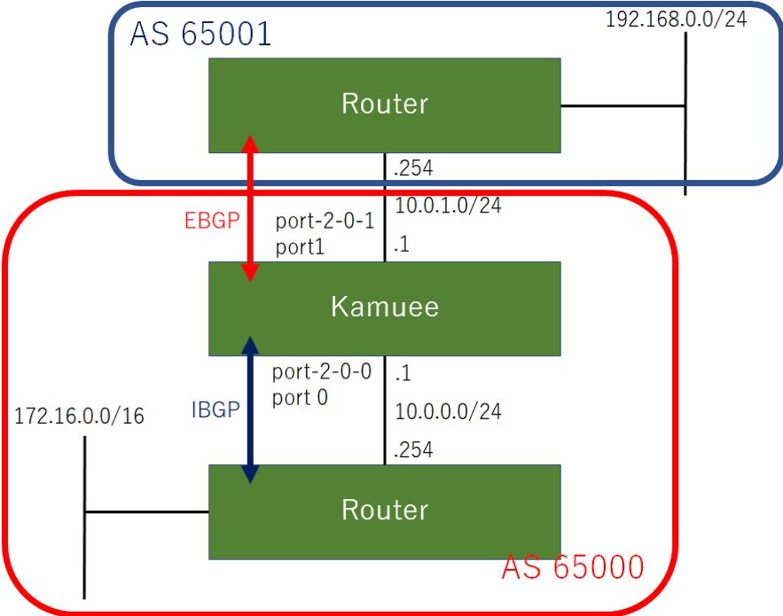

BGP IPv4 Configuration
=======================

コマンド概要
------------

.. code-block:: text

  kamuee@kamuee:~$ vi  /config/quagga/daemons                         #1. bgpdを有効にして、BGPを利用可能にします
  bgpd=yes                                                            #以下の部分を書き換えた後、Quaggaを再起動する
  kamuee@kamuee:~$ system_quagga_ctrl.sh restart                      #2. Quaggaを再起動します
  kamuee@kamuee:~$ telnet localhost bgpd                              #3. bgpdのコンソールにTelnet接続します

  User Access Verification

  Password:zebra
  bgpd@kamuee> enable                                                 #4. bgpdのコンソールを特権モードに切り替えます
  Password:zebra
  bgpd@kamuee# configure terminal                                     #5. bgpdのコンソールをグローバルコンフィグモードに切り替えます
  bgpd@kamuee(config)# router bgp 65000                               #6. AS番号65000を指定して、bgpdのコンソールをルータコンフィグモードに切り替えます
  bgpd@kamuee(config-router)# bgp router-id 1.1.1.1                   #7. BGPルータIDを1.1.1.1に設定します
  bgpd@kamuee(config-router)# neighbor 10.0.1.254 remote-as 65001     #8. IPアドレス10.0.1.254、AS番号65001のBGPビアルータを設定します
  bgpd@kamuee(config-router)# network 10.0.1.0/24                     #9. ネットワーク番号10.0.1.0/24を通知します
  bgpd@kamuee# exit                                                   #10. bgpdでひとつ前のモードに戻します。または、bgpdのコンソールのTelnet接続を終了します
  zebra@kamuee# write memory                                          #11. bgpdで現在実行中のコンフィグを保存します
  bgpd@kamuee# show running-config                                    #12. bgpdで現在実行中のコンフィグを表示します
  bgpd@kamuee# show ip bgp summary                                    #13. BGPのピアルータの概要を表示します
  bgpd@kamuee# show ip bgp                                            #14. BGP4テーブルを表示します
  bgpd@kamuee# show ip bgp neighbor                                   #15. BGPのピアルータの状態を表示します
  zebra@kamuee# show ip route                                         #16. Zebraのルーティングテーブルを表示します
  kamuee-vty[0]> show ipv4 route                                      #17. Kamueeのルーティングテーブルを表示します

BGP4設定例
----------

図のようなネットワークに、BGP4を設定する。
10.0.1.1−10.0.1.254にEBGPビアを、
10.0.0.1−10.0.0.254にIBGPピアを設定する

設定コマンド

.. code-block:: text

  zebra@kamuee(config)# interface port-2-0-0
  zebra@kamuee(config-if)# ip address 10.0.0.1/24
  zebra@kamuee(config)# interface port-2-0-1
  zebra@kamuee(config-if)# ip address 10.0.1.1/24

  kamuee@kamuee:~$ telnet localhost bgpd
  Trying ::1...
  Trying 127.0.0.1...
  Connected to localhost.
  Escape character is '^]'.

  Hello, this is Quagga (version 0.99.24.1).
  Copyright 1996-2005 Kunihiro Ishiguro, et al.

  User Access Verification

  Password:zebra
  bgpd@kamuee> enable
  Password:zebra
  bgpd@kamuee# configure terminal
  bgpd@kamuee(config)# router bgp 65000
  bgpd@kamuee(config-router)# bgp router-id 1.1.1.1
  bgpd@kamuee(config-router)# neighbor 10.0.0.254 remote-as 65000
  bgpd@kamuee(config-router)# neighbor 10.0.1.254 remote-as 65001
  bgpd@kamuee(config-router)# network 10.0.0.0 mask 255.255.255.0
  bgpd@kamuee(config-router)# network 10.0.1.0 mask 255.255.255.0
  bgpd@kamuee(config-router)# exit
  bgpd@kamuee(config)# exit
  bgpd@kamuee#

確認コマンド

.. code-block:: text

  bgpd@kamuee# show running-config

  Current configuration:
  !
  hostname bgpd@kamuee
  password zebra
  enable password zebra
  !
  router bgp 65000
   bgp router-id 1.1.1.1
  network 10.0.0.0/24
  network 10.0.1.0/24
  neighbor 10.0.0.254 remote-as 65000
   neighbor 10.0.1.254 remote-as 65001
  !
  line vty
  !
  end
  bgpd@kamuee# show ip bgp summary
  BGP router identifier 1.1.1.1, local AS number 65000
  RIB entries 3, using 336 bytes of memory
  Peers 2, using 9136 bytes of memory

  Neighbor        V         AS MsgRcvd MsgSent   TblVer  InQ OutQ Up/Down  State/PfxRcd
  10.0.0.254      4 65000      12      12        0    0    0 00:08:34        1
  10.0.1.254      4 65001      12      12        0    0    0 00:08:33        1

  Total number of neighbors 2
  bgpd@kamuee# show ip bgp
  BGP table version is 0, local router ID is 1.1.1.1
  Status codes: s suppressed, d damped, h history, * valid, > best, = multipath,
                i internal, r RIB-failure, S Stale, R Removed
  Origin codes: i - IGP, e - EGP, ? - incomplete

     Network          Next Hop            Metric LocPrf Weight Path
  *> 10.0.0.0/24      0.0.0.0                  0         32768 i
  *> 10.0.1.0/24      0.0.0.0                  0         32768 i
  *>i172.16.0.0       10.0.0.254               0    100      0 i
  *> 192.168.0.0      10.0.1.254               0             0 65001 i

  Total number of prefixes 4
  bgpd@kamuee# show ip bgp neighbors
  BGP neighbor is 10.0.0.254, remote AS 65000, local AS 65000, internal link
    BGP version 4, remote router ID 172.16.0.1
    BGP state = Established, up for 00:10:29
    Last read 00:00:29, hold time is 180, keepalive interval is 60 seconds
    Neighbor capabilities:
      4 Byte AS: advertised
      Route refresh: advertised and received(old & new)
      Address family IPv4 Unicast: advertised and received
      Graceful Restart Capabilty: advertised
    Message statistics:
      Inq depth is 0
      Outq depth is 0
                           Sent       Rcvd
      Opens:                  1          1
      Notifications:          0          0
      Updates:                1          1
      Keepalives:            12         12
      Route Refresh:          0          0
      Capability:             0          0
      Total:                 14         14
    Minimum time between advertisement runs is 5 seconds

   For address family: IPv4 Unicast
    Community attribute sent to this neighbor(both)
    1 accepted prefixes

    Connections established 1; dropped 0
    Last reset never
  Local host: 10.0.0.1, Local port: 43350
  Foreign host: 10.0.0.254, Foreign port: 179
  Nexthop: 10.0.0.1
  Nexthop global: fe80::90d0:b2ff:fee2:279a
  Nexthop local: ::
  BGP connection: non shared network
  Read thread: on  Write thread: off

  BGP neighbor is 10.0.1.254, remote AS 65001, local AS 65000, external link
    BGP version 4, remote router ID 192.168.0.1
    BGP state = Established, up for 00:10:28
    Last read 00:00:28, hold time is 180, keepalive interval is 60 seconds
    Neighbor capabilities:
      4 Byte AS: advertised
      Route refresh: advertised and received(old & new)
      Address family IPv4 Unicast: advertised and received
      Graceful Restart Capabilty: advertised
    Message statistics:
      Inq depth is 0
      Outq depth is 0
                           Sent       Rcvd
      Opens:                  1          1
      Notifications:          0          0
      Updates:                1          1
      Keepalives:            12         12
      Route Refresh:          0          0
      Capability:             0          0
      Total:                 14         14
    Minimum time between advertisement runs is 30 seconds

   For address family: IPv4 Unicast
    Community attribute sent to this neighbor(both)
    1 accepted prefixes

    Connections established 1; dropped 0
    Last reset never
  Local host: 10.0.1.1, Local port: 58944
  Foreign host: 10.0.1.254, Foreign port: 179
  Nexthop: 10.0.1.1
  Nexthop global: fe80::3426:e2ff:fe23:e7ff
  Nexthop local: ::
  BGP connection: non shared network
  Read thread: on  Write thread: off

  bgpd@kamuee#

  zebra@kamuee# show ip route
  Codes: K - kernel route, C - connected, S - static, R - RIP,
         O - OSPF, I - IS-IS, B - BGP, P - PIM, A - Babel,
         > - selected route, * - FIB route

  K>* 0.0.0.0/0 via 192.168.99.1, eno2
  C>* 10.0.0.0/24 is directly connected, port-2-0-0
  C>* 10.0.1.0/24 is directly connected, port-2-0-1
  C>* 127.0.0.0/8 is directly connected, lo
  B>* 172.16.0.0/16 [200/0] via 10.0.0.254, port-2-0-0, 00:25:20
  B>* 192.168.0.0/24 [20/0] via 10.0.1.254, port-2-0-1, 00:25:09
  zebra@kamuee#

  kamuee-vty[0]> show ipv4 route
  10.0.0.0/24 nexthop: 0.0.0.0 port: 0 flags: CONNECTED
  10.0.0.0/32 nexthop: 0.0.0.0 port: 0 flags: BLACKHOLE
  10.0.0.1/32 local port: 0
  10.0.0.254/32 ether: 00:11:93:0b:26:60 port: 0
  10.0.0.255/32 nexthop: 0.0.0.0 port: 0 flags: BLACKHOLE
  10.0.1.0/24 nexthop: 0.0.0.0 port: 1 flags: CONNECTED
  10.0.1.0/32 nexthop: 0.0.0.0 port: 1 flags: BLACKHOLE
  10.0.1.1/32 local port: 1
  10.0.1.254/32 ether: 00:0b:be:8b:73:80 port: 1
  10.0.1.255/32 nexthop: 0.0.0.0 port: 1 flags: BLACKHOLE
  127.0.0.0/8 local port: 255
  127.0.0.0/32 nexthop: 0.0.0.0 port: 255 flags: BLACKHOLE
  127.0.0.1/32 local port: 255
  127.255.255.255/32 nexthop: 0.0.0.0 port: 255 flags: BLACKHOLE
  172.16.0.0/16 nexthop: 10.0.0.254 port: 0 flags:
  192.168.0.0/24 nexthop: 10.0.1.254 port: 1 flags:
  kamuee-vty[0]>

解説

BGPを利用するには、bgpdを起動する必要があります。
bgpdを起動するには、/config/quagga/daemonsの以下の太字の部分をyesにして、
Quaggaを再起動します。

.. code-block:: text

  # This file tells the quagga package which daemons to start.
  #
  # Entries are in the format: <daemon>=(yes|no|priority)
  #   0, "no"  = disabled
  #   1, "yes" = highest priority
  #   2 .. 10  = lower priorities
  # Read /usr/share/doc/quagga/README.Debian for details.
  #
  # Sample configurations for these daemons can be found in
  # /usr/share/doc/quagga/examples/.
  #
  # ATTENTION:
  #
  # When activation a daemon at the first time, a config file, even if it is
  # empty, has to be present *and* be owned by the user and group "quagga", else
  # the daemon will not be started by /etc/init.d/quagga. The permissions should
  # be u=rw,g=r,o=.
  # When using "vtysh" such a config file is also needed. It should be owned by
  # group "quaggavty" and set to ug=rw,o= though. Check /etc/pam.d/quagga, too.
  #
  # The watchquagga daemon is always started. Per default in monitoring-only but
  # that can be changed via /etc/quagga/debian.conf.
  #
  zebra=yes
  bgpd=yes  #<-----
  ospfd=no
  ospf6d=no
  ripd=no
  ripngd=no
  isisd=no
  babeld=no

bgpdからCiscoルータライクなコマンドを使用して、BGPを設定できます。
Zebraのデフォルトのパスワードは、zebraです。

BGPネイバーテーブルやBGPデータベースなど、BGPに関連するステータスは、
bgpdから確認します。ルーティングテーブルは、ZebraとKamueeから確認します。

bgpd起動時に自動的に読み込む設定は、write memoryコマンドで保存できます。
Zebraのwrite memoryコマンドはZebraの設定のみを保存します。
同様に、bgpdのwrite memoryコマンドはbgpdの設定のみを保存します。
これは、Zebraとbgpdとは設定が別々になっているためです。

