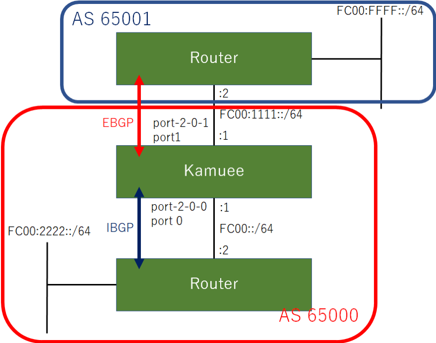

BGP IPv6 Configuration
=======================

コマンド概要
------------

.. code-block:: text

  kamuee@kamuee:~$ vi  /config/quagga/daemons                          #1. bgpdを有効にして、BGPを利用可能にします
  bgpd=yes                                                             #以下の部分を書き換えた後、Quaggaを再起動する
  kamuee@kamuee:~$ system_quagga_ctrl.sh restart                       #2. Quaggaを再起動します
  kamuee@kamuee:~$ telnet localhost bgpd                               #3. bgpdのコンソールにTelnet接続します

  User Access Verification

  Password:zebra
  bgpd@kamuee> enable                                                  #4. bgpdのコンソールを特権モードに切り替えます
  Password:zebra
  bgpd@kamuee# configure terminal                                      #5. bgpdのコンソールをグローバルコンフィグモードに切り替えます
  bgpd@kamuee(config)# router bgp 65000                                #6. AS番号65000を指定して、bgpdのコンソールをルータコンフィグモードに切り替えます
  bgpd@kamuee(config-router)# bgp router-id 1.1.1.1                    #7. BGPルータIDを1.1.1.1に設定します
  bgpd@kamuee(config-router)# neighbor 10.0.1.254 remote-as 65001      #8. IPアドレス10.0.1.254、AS番号65001のBGPビアルータを設定します
  bgpd@kamuee(config-router)# address-family ipv6                      #9. IPv6アドレスファミリを指定して、アドレスファミリコンフィグモードに切り替えます
  bgpd@kamuee(config-router-af)# neighbor fc00::2 activate             #9. アドレスファミリでピアルータを有効にします
  bgpd@kamuee(config-router-af)# network fc00::/64                     #10. アドレスファミリでネットワーク番号fc00::/64を通知します
  bgpd@kamuee(config-router-af)# exit-address-family                   #11. アドレスファミリコンフィグモードからルータコンフィグモードに戻します
  bgpd@kamuee# exit                                                    #12. bgpdでひとつ前のモードに戻します。または、bgpdのコンソールのTelnet接続を終了します
  zebra@kamuee# write memory                                           #13. bgpdで現在実行中のコンフィグを保存します
  bgpd@kamuee# show running-config                                     #14. bgpdで現在実行中のコンフィグを表示します
  bgpd@kamuee# show ip bgp summary                                     #15. BGPのピアルータの概要を表示します
  bgpd@kamuee# show ipv6 bgp                                           #16. BGP6テーブルを表示します
  bgpd@kamuee# show ip bgp neighbor                                    #17. BGPのピアルータの状態を表示します
  zebra@kamuee# show ipv6 route                                        #18. Zebraのルーティングテーブルを表示します
  kamuee-vty[0]> show ipv6 route                                       #19. Kamueeのルーティングテーブルを表示します

BGP6設定例
----------

BGP6設定例
図のようなネットワークに、BGP6を設定する。
FC00:11111::1−FC00:1111::2にEBGPビアを、
FC00::1−FC00::2にIBGPピアを設定する

設定コマンド

.. code-block:: text

  zebra@kamuee(config)# interface port-2-0-0
  zebra@kamuee(config-if)# ip address 10.0.0.1/24
  zebra@kamuee(config)# interface port-2-0-1
  zebra@kamuee(config-if)# ip address 10.0.1.1/24

  kamuee@kamuee:~$ telnet localhost bgpd
  Trying ::1...
  Trying 127.0.0.1...
  Connected to localhost.
  Escape character is '^]'.

  Hello, this is Quagga (version 0.99.24.1).
  Copyright 1996-2005 Kunihiro Ishiguro, et al.

  User Access Verification

  Password:zebra
  bgpd@kamuee> enable
  Password:zebra
  bgpd@kamuee# configure terminal
  bgpd@kamuee(config)# router bgp 65000
  bgpd@kamuee(config-router)# bgp router-id 1.1.1.1
  bgpd@kamuee(config-router)# neighbor fc00::2 remote-as 65000
  bgpd@kamuee(config-router)# neighbor fc00:1111::2 remote-as 65001
  bgpd@kamuee(config-router)# address-family ipv6
  bgpd@kamuee(config-router-af)# neighbor fc00::2 activate
  bgpd@kamuee(config-router-af)# neighbor fc00:1111::2 activate
  bgpd@kamuee(config-router-af)# network fc00::/64
  bgpd@kamuee(config-router-af)# network fc00:1111::/64
  bgpd@kamuee(config-router-af)# exit-address-family
  bgpd@kamuee(config-router)# exit
  bgpd@kamuee(config)# exit
  bgpd@kamuee#

確認コマンド

.. code-block:: text

  bgpd@kamuee# show running-config

  Current configuration:
  !
  hostname bgpd@kamuee
  password zebra
  enable password zebra
  !
  router bgp 65000
   bgp router-id 1.1.1.1
   neighbor fc00::2 remote-as 65000
   neighbor fc00:1111::2 remote-as 65001
  !
  address-family ipv6
   network fc00::/64
   network fc00:1111::/64
   neighbor fc00::2 activate
   neighbor fc00:1111::2 activate
   exit-address-family

  !
  line vty
  !
  end
  bgpd@kamuee# show ip bgp summary
  BGP router identifier 1.1.1.1, local AS number 65000
  RIB entries 0, using 0 bytes of memory
  Peers 2, using 9136 bytes of memory

  Neighbor        V         AS MsgRcvd MsgSent   TblVer  InQ OutQ Up/Down  State/PfxRcd
  fc00::2         4 65000      77     253        0    0    0 00:15:19        0
  fc00:1111::2    4 65001      80     256        0    0    0 00:12:45        0

  Total number of neighbors 2
  bgpd@kamuee# show ipv6 bgp
  BGP table version is 0, local router ID is 1.1.1.1
  Status codes: s suppressed, d damped, h history, * valid, > best, = multipath,
                i internal, r RIB-failure, S Stale, R Removed
  Origin codes: i - IGP, e - EGP, ? - incomplete

     Network          Next Hop            Metric LocPrf Weight Path
  *> fc00::/64        ::                       0         32768 i
  *> fc00:1111::/64   ::                       0         32768 i
  *>ifc00:2222::/64   fc00::2                  0    100      0 i
  *> fc00:ffff::/64   fc00:1111::2             0             0 65001 i

  Total number of prefixes 4
  bgpd@kamuee# show ip bgp neighbors
  BGP neighbor is fc00::2, remote AS 65000, local AS 65000, internal link
    BGP version 4, remote router ID 172.16.0.1
    BGP state = Established, up for 00:16:47
    Last read 00:00:47, hold time is 180, keepalive interval is 60 seconds
    Neighbor capabilities:
      4 Byte AS: advertised
      Route refresh: advertised and received(old & new)
      Address family IPv4 Unicast: advertised and received
      Address family IPv6 Unicast: advertised and received
      Graceful Restart Capabilty: advertised
    Message statistics:
      Inq depth is 0
      Outq depth is 0
                           Sent       Rcvd
      Opens:                 59         59
      Notifications:         58          0
      Updates:                3          1
      Keepalives:           134         18
      Route Refresh:          0          0
      Capability:             0          0
      Total:                254         78
    Minimum time between advertisement runs is 5 seconds

   For address family: IPv4 Unicast
    Community attribute sent to this neighbor(both)
    0 accepted prefixes

   For address family: IPv6 Unicast
    Community attribute sent to this neighbor(both)
    1 accepted prefixes

    Connections established 59; dropped 58
    Last reset 00:17:02, due to BGP Notification send
  Local host: fc00::1, Local port: 56150
  Foreign host: fc00::2, Foreign port: 179
  Nexthop: 1.1.1.1
  Nexthop global: fc00::1
  Nexthop local: fe80::a236:9fff:fe39:1728
  BGP connection: shared network
  Read thread: on  Write thread: off

  BGP neighbor is fc00:1111::2, remote AS 65001, local AS 65000, external link
    BGP version 4, remote router ID 192.168.0.1
    BGP state = Established, up for 00:14:13
    Last read 00:00:13, hold time is 180, keepalive interval is 60 seconds
    Neighbor capabilities:
      4 Byte AS: advertised
      Route refresh: advertised and received(old & new)
      Address family IPv4 Unicast: advertised and received
      Address family IPv6 Unicast: advertised and received
      Graceful Restart Capabilty: advertised
    Message statistics:
      Inq depth is 0
      Outq depth is 0
                           Sent       Rcvd
      Opens:                 63         59
      Notifications:         59          3
      Updates:                2          2
      Keepalives:           134         18
      Route Refresh:          0          0
      Capability:             0          0
      Total:                258         82
    Minimum time between advertisement runs is 30 seconds

   For address family: IPv4 Unicast
    Community attribute sent to this neighbor(both)
    0 accepted prefixes

   For address family: IPv6 Unicast
    Community attribute sent to this neighbor(both)
    1 accepted prefixes

    Connections established 60; dropped 59
    Last reset 00:14:26, due to BGP Notification send
  Local host: fc00:1111::1, Local port: 49544
  Foreign host: fc00:1111::2, Foreign port: 179
  Nexthop: 1.1.1.1
  Nexthop global: fc00:1111::1
  Nexthop local: fe80::3426:e2ff:fe23:e7ff
  BGP connection: shared network
  Read thread: on  Write thread: off

  bgpd@kamuee#bgpd@kamuee#

  zebra@kamuee# show ipv6 route
  Codes: K - kernel route, C - connected, S - static, R - RIPng,
         O - OSPFv6, I - IS-IS, B - BGP, A - Babel,
         > - selected route, * - FIB route

  C>* ::1/128 is directly connected, lo
  C>* fc00::/64 is directly connected, port-2-0-0
  C>* fc00:1111::/64 is directly connected, port-2-0-1
  B>* fc00:2222::/64 [200/0] via fc00::2, port-2-0-0, 00:19:52
  B>* fc00:ffff::/64 [20/0] via fe80::20b:beff:fe8b:7380, port-2-0-1, 00:17:17
  C * fe80::/64 is directly connected, port-2-0-0
  C * fe80::/64 is directly connected, port-2-0-1
  zebra@kamuee#

  kamuee-vty[0]> show ipv6 route
  ::1/128 local port: 255
  fc00::/64 nexthop-index: 0 fe80::20b:beff:fe8b:7380 port: 0 flags: CONNEC
  fc00::1/128 local port: 255
  fc00::2/128 ether: 00:11:93:0b:26:60 port: 0
  fc00:1111::/64 nexthop-index: 0 fe80::20b:beff:fe8b:7380 port: 1 flags: CONNEC
  fc00:1111::1/128 local port: 255
  fc00:1111::2/128 ether: 00:0b:be:8b:73:80 port: 1
  fc00:2222::/64 nexthop-index: 1 fc00::2 port: 0 flags:
  fc00:ffff::/64 nexthop-index: 0 fe80::20b:beff:fe8b:7380 port: 1 flags:
  fe80::20b:beff:fe8b:7380/128 ether: 00:0b:be:8b:73:80 port: 1
  fe80::211:93ff:fe0b:2660/128 ether: 00:11:93:0b:26:60 port: 0
  fe80::3426:e2ff:fe23:e7ff/128 local port: 255
  fe80::a236:9fff:fe39:1728/128 local port: 255
  kamuee-vty[0]>

解説

BGPを利用するには、bgpdを起動する必要があります。
bgpdを起動するには、/config/quagga/daemonsの以下の太字の部分をyesにして、
Quaggaを再起動します。

.. code-block:: text

  # This file tells the quagga package which daemons to start.
  #
  # Entries are in the format: <daemon>=(yes|no|priority)
  #   0, "no"  = disabled
  #   1, "yes" = highest priority
  #   2 .. 10  = lower priorities
  # Read /usr/share/doc/quagga/README.Debian for details.
  #
  # Sample configurations for these daemons can be found in
  # /usr/share/doc/quagga/examples/.
  #
  # ATTENTION:
  #
  # When activation a daemon at the first time, a config file, even if it is
  # empty, has to be present *and* be owned by the user and group "quagga", else
  # the daemon will not be started by /etc/init.d/quagga. The permissions should
  # be u=rw,g=r,o=.
  # When using "vtysh" such a config file is also needed. It should be owned by
  # group "quaggavty" and set to ug=rw,o= though. Check /etc/pam.d/quagga, too.
  #
  # The watchquagga daemon is always started. Per default in monitoring-only but
  # that can be changed via /etc/quagga/debian.conf.
  #
  zebra=yes
  bgpd=yes     #<---------
  ospfd=no
  ospf6d=no
  ripd=no
  ripngd=no
  isisd=no
  babeld=no

bgpdからCiscoルータライクなコマンドを使用して、BGPを設定できます。
Zebraのデフォルトのパスワードは、zebraです。

BGPネイバーテーブルやBGPデータベースなど、BGPに関連するステータスは、
bgpdから確認します。ルーティングテーブルは、ZebraとKamueeから確認します。

bgpd起動時に自動的に読み込む設定は、write memoryコマンドで保存できます。
Zebraのwrite memoryコマンドはZebraの設定のみを保存します。
同様に、bgpdのwrite memoryコマンドはbgpdの設定のみを保存します。
これは、Zebraとbgpdとは設定が別々になっているためです。

