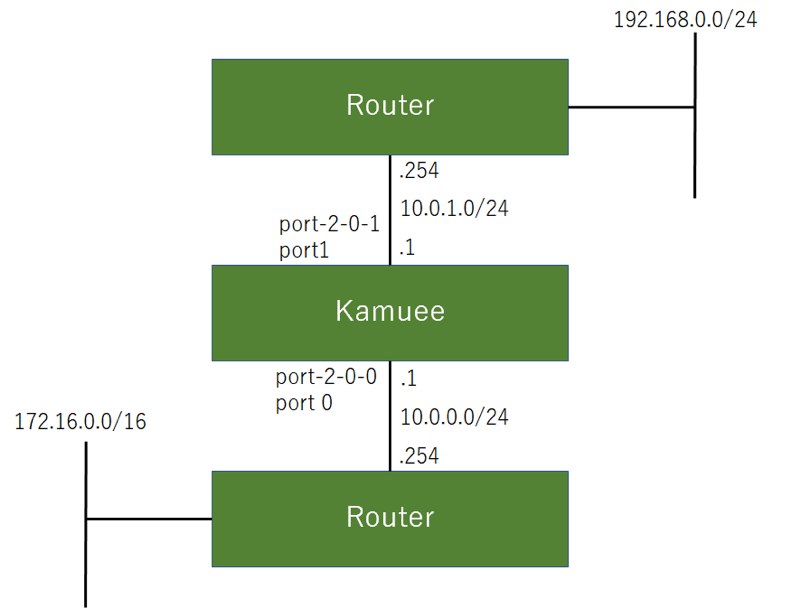
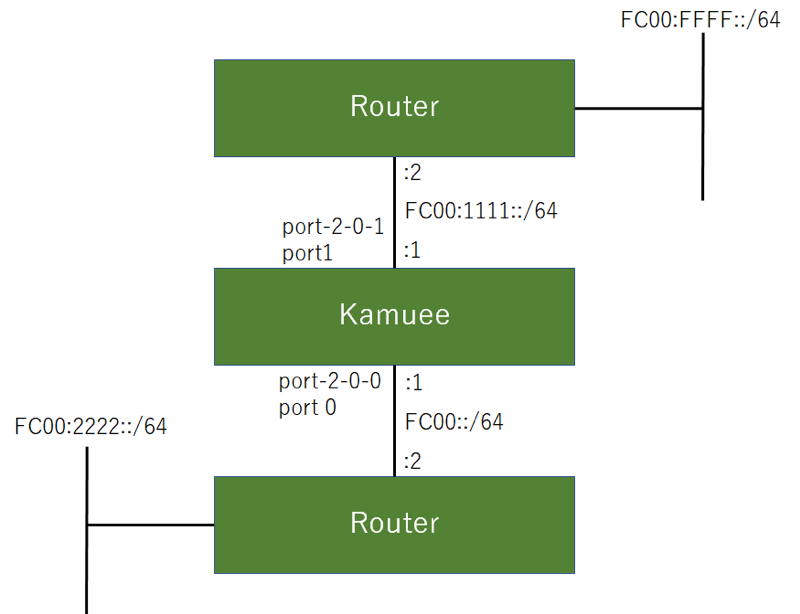
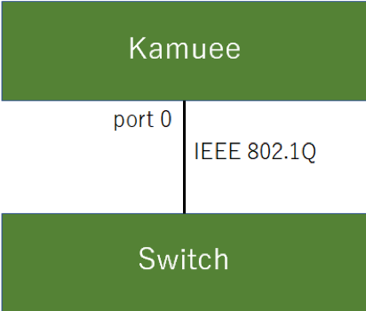

Interface Configration
======================

IPv4 Configuration
------------------

コマンド概要
^^^^^^^^^^^^

.. code-block:: text

  kamuee@kamuee:~$ telnet localhost kamuee                   #1. KamueeのコンソールにTelnet接続します
  kamuee-vty[0]> show port                                   #2. Kamueeが認識している物理ポートを表示して、Zebraから設定する際に必要な、物理ポートのデバイス名を表示します
  kamuee-vty[0]> show ipv4 route                             #3. Kamueeのルーティングテーブルを表示します
  kamuee-vty[0]> exit                                        #4. KamueeのコンソールのTelnet接続を終了します
  kamuee@kamuee:~$ telnet localhost zebra                    #5. ZebraのコンソールにTelnet接続します

  User Access Verification
  Password:zebra
  zebra@kamuee> enable                                       #6. Zebraのコンソールを特権モードに切り替えます
  Password:zebra
  zebra@kamuee# configure terminal                           #7. Zebraのコンソールをグローバルコンフィグモードに切り替えます
  zebra@kamuee(config)# interface port-2-0-1                 #8. 物理ポートのデバイス名port-2-0-0を指定して、Zebraのコンソールをインターフェイスコンフィグモードに切り替えます
  zebra@kamuee(config-if)# ip address 10.0.0.1/24            #9. ZebraからポートにIPアドレス10.0.0.1、24ビットサブネットマスクを設定します
  zebra@kamuee(config)# ip route 192.168.0.0/24 10.0.1.254   #10. Zebraからネットワーク192.168.0.0/24、ネクストホップ10.0.1.254へのスタティックルートを設定します
  zebra@kamuee(config)# exit                                 #11. Zebraでひとつ前のモードに戻します。または、ZebraのコンソールのTelnet接続を終了します
  zebra@kamuee# show running-config                          #12. Zebraで現在実行中のコンフィグを表示します
  zebra@kamuee# show ip route                                #13. Zebraのルーティングテーブルを表示します
  zebra@kamuee# write memory                                 #14. Zebraで現在実行中のコンフィグを保存します
  kamuee@kamuee:~$ ping 10.0.1.1                             #15. 10.0.1.1へ通信できるかどうか確認します

IPv4基本設定例
^^^^^^^^^^^^^^

Kamueeのport 0のLinuxデバイス名はport-2-0-0、
port 1のLinuxデバイス名はport-2-0-1である。
port 0にIPアドレス10.0.0.1/24を、
port 1にIPアドレス10.0.1.1/24を設定する。
Kamueeにスタティックルートを設定して、
172.16.0.0/16へのネクストホップを10.0.0.254に、
192.168.0.0/24へのネクストホップを10.0.1.254に設定する。

設定コマンド

.. code-block:: text

  kamuee@kamuee:~$ telnet localhost zebra

  User Access Verification

  Password:zebra
  zebra@kamuee> enable
  Password:zebra
  zebra@kamuee# configure terminal
  zebra@kamuee(config)# interface port-2-0-0
  zebra@kamuee(config-if)# ip address 10.0.0.1/24
  zebra@kamuee(config-if)# interface port-2-0-1
  zebra@kamuee(config-if)# ip address 10.0.1.1/24
  zebra@kamuee(config-if)# exit
  zebra@kamuee(config)# ip route 172.16.0.0/16 10.0.0.254
  zebra@kamuee(config)# ip route 192.168.0.0/24 10.0.1.254
  zebra@kamuee(config)# exit
  zebra@kamuee# write memory
  Configuration saved to /etc/quagga/zebra.conf
  zebra@kamuee#

確認コマンド

.. code-block:: text

  kamuee@kamuee:~$ telnet localhost kamuee
  kamuee-vty[0]> show port
  port        id c if kni/tap mac-addr          drvr   speed supported
  port-2-0-0   0 0  0  -1/6   A0:36:9F:39:17:28 ixgbe   1000 10G/1G/100M
  port-2-0-1   1 0  0  -1/7   A0:36:9F:39:17:2A ixgbe    100 10G/1G/100M
  kamuee-vty[0]> show ipv4 route
  10.0.0.0/24 nexthop: 0.0.0.0 port: 0 flags: CONNECTED
  10.0.0.0/32 nexthop: 0.0.0.0 port: 0 flags: BLACKHOLE
  10.0.0.1/32 local port: 0
  10.0.0.255/32 nexthop: 0.0.0.0 port: 0 flags: BLACKHOLE
  10.0.1.0/24 nexthop: 0.0.0.0 port: 1 flags: CONNECTED
  10.0.1.0/32 nexthop: 0.0.0.0 port: 1 flags: BLACKHOLE
  10.0.1.1/32 local port: 1
  10.0.1.255/32 nexthop: 0.0.0.0 port: 1 flags: BLACKHOLE
  127.0.0.0/8 local port: 255
  127.0.0.0/32 nexthop: 0.0.0.0 port: 255 flags: BLACKHOLE
  127.0.0.1/32 local port: 255
  127.255.255.255/32 nexthop: 0.0.0.0 port: 255 flags: BLACKHOLE
  172.16.0.0/16 nexthop: 10.0.0.254 port: 0 flags:
  192.168.0.0/24 nexthop: 10.0.1.254 port: 1 flags:
  kamuee-vty[0]>kamuee-vty[0]> exit
  kamuee@kamuee:~$ telnet localhost zebra

  User Access Verification

  Password:zebra
  zebra@kamuee> enable
  Password:zebra
  zebra@kamuee#zebra@kamuee# show running-config

  Current configuration:
  !
  hostname zebra@kamuee
  password zebra
  enable password zebra
  !
  interface eno1
   no link-detect
   ipv6 nd suppress-ra
  !
  interface eno2
   no link-detect
   ipv6 nd suppress-ra
  !
  interface lo
   no link-detect
  !
  interface port-2-0-0
   link-detect
   ip address 10.0.0.1/24
   ipv6 nd suppress-ra
  !
  interface port-2-0-1
   link-detect
  ip address 10.0.1.1/24
   ipv6 nd suppress-ra
  !
  ip route 172.16.0.0/16 10.0.0.254
  ip route 192.168.0.0/24 10.0.1.254
  !
  ip forwarding
  !
  !
  line vty
  !
  end
  zebra@kamuee# show ip route
  Codes: K - kernel route, C - connected, S - static, R - RIP,
         O - OSPF, I - IS-IS, B - BGP, P - PIM, A - Babel,
         > - selected route, * - FIB route

  K>* 0.0.0.0/0 via 192.168.99.1, eno2
  C>* 10.0.0.0/24 is directly connected, port-2-0-0
  C>* 10.0.1.0/24 is directly connected, port-2-0-1
  C>* 127.0.0.0/8 is directly connected, lo
  S>* 172.16.0.0/16 [1/0] via 10.0.0.254, port-2-0-0
  S>* 192.168.0.0/24 [1/0] via 10.0.1.254, port-2-0-1
  zebra@kamuee# exit
  Connection closed by foreign host.
  kamuee@kamuee:~$ ping 10.0.0.254
  PING 10.0.0.254 (10.0.0.254) 56(84) bytes of data.
  64 bytes from 10.0.0.254: icmp_seq=1 ttl=64 time=0.024 ms
  64 bytes from 10.0.0.254: icmp_seq=2 ttl=64 time=0.015 ms
  64 bytes from 10.0.0.254: icmp_seq=3 ttl=64 time=0.015 ms
  64 bytes from 10.0.0.254: icmp_seq=4 ttl=64 time=0.014 ms
  ^C
  --- 10.0.0.254 ping statistics ---
  4 packets transmitted, 4 received, 0% packet loss, time 3000ms
  rtt min/avg/max/mdev = 0.014/0.017/0.024/0.004 ms
  kamuee@kamuee:~$

解説

IPアドレスとスタティックルートは、Zebraから設定します。
Zebraを使用して、物理ポートにIPアドレスを設定する前に、
Kamueeからshow portコマンドを使用して、 物理ポートのデバイス名を確認します。
デバイス名はLinuxから認識されるポートの名称で、 Zebraで物理ポートを指定する時のほか、
Linuxのifconfigコマンドなどで使用します。

Zebraを利用すると、Ciscoルータライクなコマンドを使用して、
IPアドレスやスタティックルートを設定できます。
Zebraのデフォルトのパスワードは、zebraです。

ルーティングテーブルは、ZebraとKamueeとは仕組みが異なります。
このため、ルーティングテーブルはZebraとKamueeの両方で確認します。
Zebraでルーティングテーブルを確認するコマンドは
show ip route、Kamueeでルーティングテーブルを確認するコマンドはshow ipv4 routeです。

Zebra起動時に自動的に読み込む設定は、
write memoryコマンドで保存できます。
Kamueeには、設定を保存するコマンドがありません。
Kamuee起動時に自動的に読み込むコマンドは、
/config/kamuee.confにviエディタ等で記述します。

KamueeまたはZebraからはpingコマンドを実行できません。
pingコマンドを実行するには、Linuxコマンドラインから実行します。

IPv6 Configuration
------------------

コマンド概要
^^^^^^^^^^^^

.. code-block:: text

  kamuee@kamuee:~$ telnet localhost kamuee                     #1. KamueeのコンソールにTelnet接続します
  kamuee-vty[0]> show port                                     #2. Kamueeが認識している物理ポートを表示して、Zebraから設定する際に必要な、物理ポートのデバイス名を表示します
  kamuee-vty[0]> show ipv6 route                               #3. KamueeのIPv6ルーティングテーブルを表示します
  kamuee-vty[0]> exit                                          #4. KamueeのコンソールのTelnet接続を終了します
  kamuee@kamuee:~$ telnet localhost zebra                      #5. ZebraのコンソールにTelnet接続します

  User Access Verification

  Password:zebra
  zebra@kamuee> enable                                         #6. Zebraのコンソールを特権モードに切り替えます
  Password:zebra
  zebra@kamuee# configure terminal                             #7. Zebraのコンソールをグローバルコンフィグモードに切り替えます
  zebra@kamuee(config)# interface port-2-0-1                   #8. 物理ポートのデバイス名port-2-0-0を指定して、Zebraのコンソールをインターフェイスコンフィグモードに切り替えます
  zebra@kamuee(config-if)# ipv6 address fc00::1/64             #9. ZebraからポートにIPv6アドレスFC00::1、64ビットサブネットマスクを設定します
  zebra@kamuee(config)# ipv6 route fc00:2222::/64 fc00::2      #10. ZebraからネットワークFC00:2222::/64、ネクストホップFC00::2へのスタティックルートを設定します
  zebra@kamuee# exit                                           #11. Zebraでひとつ前のモードに戻します。または、ZebraのコンソールのTelnet接続を終了します
  zebra@kamuee# show running-config                            #12. Zebraで現在実行中のコンフィグを表示します
  zebra@kamuee# show ip route                                  #13. Zebraのルーティングテーブルを表示します
  zebra@kamuee# write memory                                   #14. Zebraで現在実行中のコンフィグを保存します
  kamuee@kamuee:~$ ping6 fc00:1111::2                          #15. fc00:1111::2へ通信できるかどうか確認します

IPv6基本設定例
^^^^^^^^^^^^^^

Kamueeのport 0のLinuxデバイス名はport-2-0-0、port 1のLinuxデバイス名はport-2-0-1である。
port 0にIPアドレスFC00::1/64を、port 1にIPアドレスFC00:1111::1/64を設定する。
Kamueeにスタティックルートを設定して、FC00:2222::/64へのネクストホップをFC00::2に、
FC00:FFFF::/64へのネクストホップをFC00:1111::2に設定する。

設定コマンド

.. code-block:: text

  kamuee@kamuee:~$ telnet localhost zebra

  User Access Verification

  Password:zebra
  zebra@kamuee> enable
  Password:zebra
  zebra@kamuee# configure terminal
  zebra@kamuee(config)# interface port-2-0-0
  zebra@kamuee(config-if)# ipv6 address fc00::1/64
  zebra@kamuee(config-if)# interface port-2-0-1
  zebra@kamuee(config-if)# ipv6 address fc00:1111::1/64
  zebra@kamuee(config-if)# exit
  zebra@kamuee(config)# ipv6 route fc00:2222::/64 fc00::2
  zebra@kamuee(config)# ipv6 route fc00:ffff::/64 fc00:1111::2
  zebra@kamuee(config)# exit
  zebra@kamuee# write memory
  Configuration saved to /etc/quagga/zebra.conf
  zebra@kamuee#

確認コマンド

.. code-block:: text

  kamuee@kamuee:~$ telnet localhost kamuee
  kamuee-vty[0]> show port
  port        id c if kni/tap mac-addr          drvr   speed supported
  port-2-0-0   0 0  0  -1/6   A0:36:9F:39:17:28 ixgbe   1000 10G/1G/100M
  port-2-0-1   1 0  0  -1/7   A0:36:9F:39:17:2A ixgbe    100 10G/1G/100M
  kamuee-vty[0]> show ipv6 route
  ::1/128 local port: 255
  fc00::/64 nexthop-index: 0 fc00:1111::2 port: 0 flags: CONNECTED
  fc00::1/128 local port: 255
  fc00:ff::1/128 nexthop-index: 2 fe80::207:eff:fe4c:e52e port: 1 flags:
  fc00:1111::/64 nexthop-index: 0 fc00:1111::2 port: 1 flags: CONNECTED
  fc00:1111::1/128 local port: 255
  fc00:2222::/64 nexthop-index: 1 fc00::2 port: 0 flags:
  fc00:ffff::/64 nexthop-index: 0 fc00:1111::2 port: 1 flags:
  fe80::207:eff:fe4c:e52e/128 ether: 00:07:0e:4c:e5:2e port: 1
  fe80::8f3:dbff:fea8:21ef/128 local port: 255
  fe80::34dd:3bff:fed4:3da1/128 local port: 255
  kamuee-vty[0]> exit
  kamuee@kamuee:~$ telnet localhost zebra

  User Access Verification

  Password:zebra
  zebra@kamuee> enable
  Password:zebra
  zebra@kamuee#zebra@kamuee# show running-config

  Current configuration:
  !
  hostname zebra@kamuee
  password zebra
  enable password zebra
  !
  interface eno1
   no link-detect
   ipv6 nd suppress-ra
  !
  interface eno2
   no link-detect
   ipv6 nd suppress-ra
  !
  interface lo
   no link-detect
  !
  interface port-2-0-0
   link-detect
   ipv6 address fc00::1/64
   ipv6 nd suppress-ra

  !
  interface port-2-0-1
   link-detect
   ipv6 address fc00:1111::1/64
   ipv6 nd suppress-ra

  !
  ipv6 route fc00:2222::/64 fc00::2
  ipv6 route fc00:ffff::/64 fc00:1111::2
  !
  ip forwarding
  !
  !
  line vty
  !
  end
  zebra@kamuee# show ipv6 route
  Codes: K - kernel route, C - connected, S - static, R - RIPng,
         O - OSPFv6, I - IS-IS, B - BGP, A - Babel,
         > - selected route, * - FIB route

  C>* ::1/128 is directly connected, lo
  C>* fc00::/64 is directly connected, port-2-0-0
  O   fc00:1111::/64 [110/10] is directly connected, port-2-0-1, 00:00:03
  C>* fc00:1111::/64 is directly connected, port-2-0-1
  S>* fc00:2222::/64 [1/0] via fc00::2, port-2-0-0
  S>* fc00:ffff::/64 [1/0] via fc00:1111::2, port-2-0-1
  C * fe80::/64 is directly connected, port-2-0-1
  C * fe80::/64 is directly connected, port-2-0-0
  zebra@kamuee# exit
  Connection closed by foreign host.
  kamuee@kamuee:~$ ping6 fc00:1111::2
  PING fc00:1111::2(fc00:1111::2) 56 data bytes
  64 bytes from fc00:1111::2: icmp_seq=1 ttl=64 time=0.711 ms
  64 bytes from fc00:1111::2: icmp_seq=2 ttl=64 time=0.602 ms
  64 bytes from fc00:1111::2: icmp_seq=3 ttl=64 time=0.609 ms
  64 bytes from fc00:1111::2: icmp_seq=4 ttl=64 time=0.619 ms
  ^C
  --- fc00:1111::2 ping statistics ---
  4 packets transmitted, 4 received, 0% packet loss, time 3000ms
  rtt min/avg/max/mdev = 0.602/0.635/0.711/0.047 ms
  kamuee@kamuee:~$

解説

Kamueeのポートには、
FE80::/64のリンクローカルアドレスが自動的に構成されます。
IPv6アドレスを手動で構成する場合や、
スタティックルートを設定する場合は、
Zebraから設定します。

Zebraを使用して、物理ポートにIPv6アドレスを設定する前に、
Kamueeからshow portコマンドを使用して、
物理ポートのデバイス名を確認します。
デバイス名はLinuxから認識されるポートの名称で、
Zebraで物理ポートを指定する時のほか、
Linuxのifconfigコマンドなどで使用します。

Zebraを利用すると、Ciscoルータライクなコマンドを使用して、
IPv6アドレスやスタティックルートを設定できます。
Zebraのデフォルトのパスワードは、zebraです。

ルーティングテーブルは、ZebraとKamueeとは仕組みが異なります。
このため、ルーティングテーブルはZebraとKamueeの両方で確認します。
ZebraおよびKamueeでルーティングテーブルを確認するコマンドはshow ipv6 routeです。

Zebra起動時に自動的に読み込む設定は、
write memoryコマンドで保存できます。
Kamueeには、設定を保存するコマンドがありません。
Kamuee起動時に自動的に読み込むコマンドは、
/config/kamuee.confにviエディタ等で記述します。

KamueeまたはZebraからはpingコマンドを実行できません。
pingコマンドを実行するには、Linuxコマンドラインから実行します。

Tagged VLAN Configuration
-------------------------

コマンド概要
^^^^^^^^^^^^

.. code-block:: text

  kamuee-vty[0]> set vport 3 physical-port 0             #1. 仮想ポート3を、物理ポート0に割り当てます。仮想ポート3が存在しない場合は、自動的に作成します
  kamuee-vty[0]> set vport 4 vlan 20                     #2. 仮想ポート4を、VLAN番号20に割り当てます。仮想ポート4が存在しない場合は、自動的に作成します
  kamuee-vty[0]> set vport 5 physical-port 1 vlan 30     #3. 仮想ポート5をVLAN番号30、物理ポート1に割り当てます。仮想ポート５が存在しない場合は、自動的に作成します
  zebra@kamuee(config)# interface vlan0030               #4. VLAN番号30へIPアドレス172.16.0.1/24を割り当てます
  zebra@kamuee(config-if)# ip address 172.16.0.1/24
  kamuee-vty[0]> show vport                              #5. 作成した仮想ポートを表示します

Tagged VLAN基本設定例
^^^^^^^^^^^^^^^^^^^^^

Switch 1とSwitch2のリンクを、タグ付きVLANに設定する。
タギングして転送するVLANは10、20、30とする。
仮想ポート番号は、1、2、3を使用する。
VLAN 10にIPアドレス10.0.0.1/24、
VLAN 20にIPアドレス 10.0.1.1/24、
VLAN 30にIPアドレス10.0.2.1/24を設定する。

設定コマンド

.. code-block:: text

  Kamuee-vty[0]> set vport 1 physical-port 0 vlan 10
  Kamuee-vty[0]> set vport 2 physical-port 0 vlan 20
  Kamuee-vty[0]> set vport 3 physical-port 0 vlan 30

  zebra@kamuee(config)# interface vlan0010
  zebra@kamuee(config-if)# ip address 10.0.0.1/24
  zebra@kamuee(config-if)# interface vlan0020
  zebra@kamuee(config-if)# ip address 10.0.1.1/24
  zebra@kamuee(config-if)# interface vlan0030
  zebra@kamuee(config-if)# ip address 10.0.2.1/24

確認コマンド

.. code-block:: text

  Kamuee-vty[0]> show vport
  vport     name      low phy kni vlan
  vport1:   vlan0010   --   0 236   10
  vport2:   vlan0020   --   0 237   20
  vport3:   vlan0020   --   0 237   30
  Kamuee-vty[0]>

解説

タグ付きVLANを使用するには、Kamueeから仮想ポートを作成して、
VLAN番号と物理ポートを紐づけます。コマンドは、set vportコマンドです。

仮想ポートを作成後、show vportコマンドを使用して、
仮想ポートが作成されていることを確認します。
また、show vportコマンドのname欄に、デバイス名が表示されるので、
確認します。例えば、VLAN番号10のデバイス名は、vlan0010です。

VLANにIPアドレスを割り当てるには、Zebraから、
先ほどKamueeのshow vportコマンドで確認したデバイスへ、
ip addressコマンドで割り当てます。

Native VLANに相当する機能はありません。
show vportコマンドでタグ付きVLANを使用する設定を行ったか否かにかかわらず、
Zebraから物理ポートへIPアドレスを割り当てれば、タグなしでパケット転送します。

1つの物理ポートに、複数の仮想ポートを割り当てることができます。
例えば、以下のような設定が可能です。
設定可能な構成例：1つの物理ポートに複数の仮想ポートを割り当てる

.. code-block:: text

  Kamuee-vty[0]> set vport 1 physical-port 0
  Kamuee-vty[0]> set vport 2 physical-port 0
  Kamuee-vty[0]> set vport 3 physical-port 0

ただし、1つの仮想ポートを複数の物理ポートに割り当てたり、
複数の仮想ポートに同一VLANを割り当てたりすることはできません。
例えば、以下のような構成はできません。
設定できない構成例：1つの仮想ポートを複数の物理ポートに割り当てる

.. code-block:: text

  Kamuee-vty[0]> set vport 1 physical-port 0
  Kamuee-vty[0]> set vport 1 physical-port 1

設定できない構成例：複数の仮想ポートに同一VLANを割り当てる

.. code-block:: text

  Kamuee-vty[0]> set vport 1 vlan 30
  Kamuee-vty[0]> set vport 2 vlan 30

