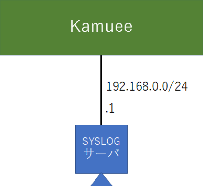

Log Configration
================

コマンド概要
------------

.. code-block:: text

  kamuee@kamuee:~$ vi  /config/rsyslog.conf             #1. IPアドレス192.168.0.1のSYSLOGサーバに、ログを記録します
  # *.*;auth,authpriv.none          @@192.168.0.1       #以下の部分を追記した後、rsyslogデーモンを再起動する
  kamuee@kamuee:/$ system_rsyslog_ctrl.sh restart       #2. rsyslogデーモンを再起動します。
  kamuee@kamuee:/$ show_tech.sh                         #3. Kamueeシステムの診断情報を画面出力します

Syslog設定例
------------

IPアドレス192.168.0.1のSYSLOGサーバに、ログを記録する。

設定コマンド

.. code-block:: text

  kamuee@kamuee:~$ vi /config/rsyslog.conf
  （以下のエントリを追加）
  *.*;auth,authpriv.none         @@192.168.0.1
  kamuee@kamuee:~$ system_rsyslog_ctrl.sh restart

確認コマンド

注：SYSLOG設定を確認するコマンドはありません

.. code-block:: text

  kamuee@kamuee:~$ show_tech.sh
  ==== Kamuee Router Dump ====
  ==== 1. Kamuee Process ====
  spawn telnet localhost 9077
  Trying ::1...
  Trying 127.0.0.1...
  Connected to localhost.
  Escape character is '^]'.

  （中略）

  ==== 6. Logs ====
  # dmesg
  May 31 06:25:01 localhost rsyslogd: [origin software="rsyslogd" swVersion="8.16.0" x-pid="1191" x-info="http://www.rsyslog.com"] rsyslogd was HUPed
  May 31 06:25:01 kamuee CRON[4356]: (CRON) info (No MTA installed, discarding output)
  May 31 06:25:20 kamuee ntpd[1561]: error resolving pool ntp.ubuntu.com: Temporary failure in name resolution (-3)
  May 31 06:25:27 kamuee ntpd[1561]: error resolving pool 1.ubuntu.pool.ntp.org: Temporary failure in name resolution (-3)
  May 31 06:25:33 kamuee ntpd[1561]: error resolving pool 3.ubuntu.pool.ntp.org: Temporary failure in name resolution (-3)
  May 31 06:25:37 kamuee ntpd[1561]: error resolving pool 2.ubuntu.pool.ntp.org: Temporary failure in name resolution (-3)
  May 31 06:26:01 kamuee ntpd[1561]: error resolving pool 0.ubuntu.pool.ntp.org: Temporary failure in name resolution (-3)
  May 31 06:26:25 kamuee ntpd[1561]: error resolving pool ntp.ubuntu.com: Temporary failure in name resolution (-3)
  May 31 06:26:34 kamuee ntpd[1561]: error resolving pool 1.ubuntu.pool.ntp.org: Temporary failure in name resolution (-3)
  May 31 06:26:37 kamuee ntpd[1561]: error resolving pool 3.ubuntu.pool.ntp.org: Temporary failure in name resolution (-3)
  （以下、省略）

解説

Kamueeシステムは、rsyslogデーモンでログを管理しています。
rsyslogデーモンの設定ファイルは、/config/rsyslog.confです。
IPアドレス192.168.0.1のSYSLOGサーバにログを出力するにはまず、
/config/rsyslog.confに以下の太字の部分を追記します。

.. code-block:: text

  #################
  #### MODULES ####
  #################

  module(load="imuxsock") # provides support for local system logging
  module(load="imklog")   # provides kernel logging support
  #module(load="immark")  # provides --MARK-- message capability

  # provides UDP syslog reception
  #module(load="imudp")
  #input(type="imudp" port="514")

  # provides TCP syslog reception
  #module(load="imtcp")
  #input(type="imtcp" port="514")

  # Enable non-kernel facility klog messages
  $KLogPermitNonKernelFacility on

  ###########################
  #### GLOBAL DIRECTIVES ####
  ###########################

  #
  # Use traditional timestamp format.
  # To enable high precision timestamps, comment out the following line.
  #
  $ActionFileDefaultTemplate RSYSLOG_TraditionalFileFormat

  # Filter duplicated messages
  $RepeatedMsgReduction on

  #
  # Set the default permissions for all log files.
  #
  $FileOwner syslog
  $FileGroup adm
  $FileCreateMode 0640
  $DirCreateMode 0755
  $Umask 0022
  $PrivDropToUser syslog
  $PrivDropToGroup syslog

  #
  # Where to place spool and state files
  #
  $WorkDirectory /var/spool/rsyslog

  # Log kernel generated UFW log messages to file
  :msg,contains,"[UFW " /var/log/ufw.log

  #  Default rules for rsyslog.

  # Log by facility
  auth,authpriv.*                 /var/log/auth.log
  *.*;auth,authpriv.none          -/var/log/syslog
  *.*;auth,authpriv.none          @@192.168.0.1   #<--------
  #cron.*                         /var/log/cron.log
  #daemon.*                       -/var/log/daemon.log
  kern.*                          -/var/log/kern.log
  #lpr.*                          -/var/log/lpr.log
  mail.*                          -/var/log/mail.log
  #user.*                         -/var/log/user.log

  （以下、省略）

次に、rsyslogデーモンを再起動します。
コマンドは、system_rsyslog_ctrl.sh restartです。

SYSLOGサーバへログが正常に送信できているかどうかを、
Kamueeシステムで確認するコマンドはありません。
SYSLOGサーバを確認して、ログが正常に受信できていることを確認します。

Kamueeシステムのログを参照するには、show_tech.shコマンドを使用して、
診断情報を画面出力します。
このコマンドは、大量のログを表示しますのでご注意ください。

