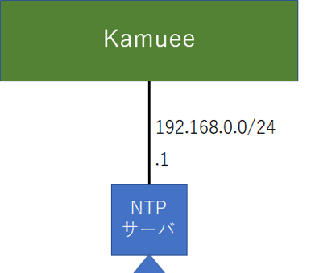

NTP Config
==========

コマンド概要
------------

.. code-block:: text

  kamuee@kamuee:~$ system_ntp_ctrl.sh stop                     #1. NTPデーモンを停止します
  kamuee@kamuee:~$ system_ntp_force_set_time.sh 192.168.0.1    #2. IPアドレス192.168.0.1のNTPサーバと強制的に時刻を同期します
  kamuee@kamuee:~$ system_ntp_ctrl.sh start                    #3. NTPデーモンを起動します
  kamuee@kamuee:~$ date                                        #4. 現在の時刻とタイムゾーンを表示します
  kamuee@kamuee:~$ vi  /config/ntp.conf                        #5. NTPデーモンを使用して、IPアドレス192.168.0.1のNTPサーバと定期的に時刻を同期します

  # 以下の部分を追記した後、NTPデーモンを再起動する
  # pool 192.168.0.1

  kamuee@kamuee:~$ system_ntp_ctrl.sh restart                  #6. NTPデーモンを再起動します
  kamuee@kamuee:~$ ntpq -p                                     #7. NTPデーモンの時刻同期を確認します
  kamuee@kamuee:~$ system_show_timezone_list.sh                #8. タイムゾーンとして設定可能な文字列を表示します
  kamuee@kamuee:~$ system_set_timezone.sh Asia/Tokyo           #9. タイムゾーンをJST（日本標準時）に設定します

NTP設定例1
----------

Kamueeは、インターネットに接続できない環境に存在する。IPアドレスが192.168.0.1のNTPサーバと強制的に時刻同期する。

設定コマンド

.. code-block:: text

  kamuee@kamuee:~$ system_ntp_ctrl.sh stop
  kamuee@kamuee:~$ system_ntp_force_set_time.sh 192.168.0.1
   1 Jun 02:11:24 ntpdate[2164]: step time server 192.168.0.1 offset -33.801968 sec
  kamuee@kamuee:~$ system_ntp_ctrl.sh start

確認コマンド

.. code-block:: text

  kamuee@kamuee:~$ date
  Fri Jun  1 02:23:37 UTC 2018
  kamuee@kamuee:~$

NTP設定例2
----------

Kamueeは、インターネットに接続できない環境に存在する。
IPアドレスが192.168.0.1のNTPサーバと時刻同期する。
また、タイムゾーンをJST（日本標準時）にする。

設定コマンド

.. code-block:: text

	kamuee@kamuee:~$ vi /conf/ntp.conf
	（以下のエントリを追加）
	pool 192.168.0.1
	kamuee@kamuee:~$ system_ntp_ctrl.sh start
	kamuee@kamuee:~$ system_set_timezone.sh Asia/Tokyo

確認コマンド

.. code-block:: text

	kamuee@kamuee:~$ ntpq -p
			 remote           refid      st t when poll reach   delay   offset  jitter
	==============================================================================
	 0.ubuntu.pool.n .POOL.          16 p    -   64    0    0.000    0.000   0.000
	 1.ubuntu.pool.n .POOL.          16 p    -   64    0    0.000    0.000   0.000
	 2.ubuntu.pool.n .POOL.          16 p    -   64    0    0.000    0.000   0.000
	 3.ubuntu.pool.n .POOL.          16 p    -   64    0    0.000    0.000   0.000
	 192.168.99.16   .POOL.          16 p    -   64    0    0.000    0.000   0.000
	 ntp.ubuntu.com  .POOL.          16 p    -   64    0    0.000    0.000   0.000
	*192.168.99.16   LOCAL(0)        11 u   42   64   17    0.222  -57.946  19.933
	kamuee@kamuee:~$ date
	Fri Jun  1 12:10:33 JST 2018
	kamuee@kamuee:~$

解説

NTPサーバを指定して、強制的に時刻同期を取るには、system_ntp_force_set_tim
e.shコマンドを使用します。このコマンドを実行する前に、NTPデーモンを停止する必要があります。
NTPデーモンを停止するコマンドはsystem_ntp_ctrl.sh stop、NTPデーモンを開始
するコマンドはsystem_ntp_ctrl.shです。

NTPサーバと定期的に時刻同期を行うには、NTPデーモンを使用します。NTPデーモンの設定ファイルは
、/config/ntp.confです。IPアドレス192.168.0.1のNTPサーバと時刻同期す
るにはまず、/config/ntp.confに以下の太字の部分を追記します。

.. code-block:: text

  # /etc/ntp.conf, configuration for ntpd; see ntp.conf(5) for help

  driftfile /var/lib/ntp/ntp.drift

  # Enable this if you want statistics to be logged.
  #statsdir /var/log/ntpstats/

  statistics loopstats peerstats clockstats
  filegen loopstats file loopstats type day enable
  filegen peerstats file peerstats type day enable
  filegen clockstats file clockstats type day enable

  # Specify one or more NTP servers.

  # Use servers from the NTP Pool Project. Approved by Ubuntu Technical Board
  # on 2011-02-08 (LP: #104525). See http://www.pool.ntp.org/join.html for
  # more information.
  pool 0.ubuntu.pool.ntp.org iburst
  pool 1.ubuntu.pool.ntp.org iburst
  pool 2.ubuntu.pool.ntp.org iburst
  pool 3.ubuntu.pool.ntp.org iburst
  pool 192.168.0.1

  # Use Ubuntu's ntp server as a fallback.
  pool ntp.ubuntu.com

  （以下、省略）

次に、NTPデーモンを再起動します。再起動するコマンドは、system_ntp_ctrl.sh restartです。
NTPデーモンを使用して、NTPサーバと時刻が正常に同期できているかどうかを確認するには、
ntpq-pコマンドを使用します。
表示結果のうち、先頭に*が表示されているNTPサーバと同期を取っています。
タイムゾーンのデフォルトは、UTC（世界標準時）です。
タイムゾーンを変更するには、system_set_timezone.shコマンドを使用します。
例えば、JST（日本標準時）に設定するには、
system_set_timezone.sh Asia/Tokyoコマンドです。
system_set_timezone.shコマンドで設定できるタイムゾーン文字列は、system_show_timezone_list.sh
で確認することができます。また、現在のタイムゾーンを確認す
るには、dateコマンドを使用します。

