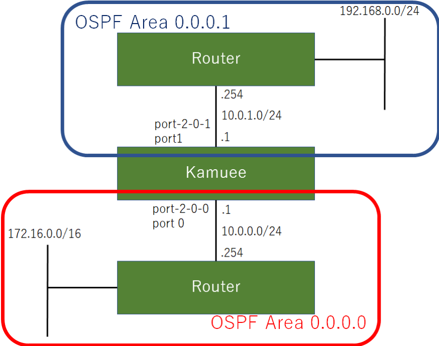

OSPFv2 Configuration
=====================

コマンド概要
------------

.. code-block:: text

  kamuee@kamuee:~$ vi  /config/quagga/daemons                           #1. ospfdを有効にして、OSPFを利用可能にします
  ospfd=yes                                                             #以下の部分を書き換えた後、Quaggaを再起動する
  kamuee@kamuee:~$ system_quagga_ctrl.sh restart                        #2. Quaggaを再起動します
  kamuee@kamuee:~$ telnet localhost ospfd                               #3. ospfdのコンソールにTelnet接続します

  User Access Verification

  Password:zebra
  ospfd@kamuee> enable                                                  #4. ospfdのコンソールを特権モードに切り替えます
  Password:zebra
  ospfd@kamuee# configure terminal                                      #5. ospfdのコンソールをグローバルコンフィグモードに切り替えます
  ospfd@kamuee(config)# router ospf                                     #6. ospfdのコンソールをルータコンフィグモードに切り替えます
  ospfd@kamuee(config-router)# network 10.0.0.0/24 area 0.0.0.0         #7. ネットワーク番号10.0.0.0/24に属するネットワークへ、OSPFをエリア0.0.0.0で設定します
  ospfd@kamuee(config-if)# ip ospf mtu-ignore                           #8. ネイバーとMTUが一致していない場合でも、OSPFネイバー関係を結ぶよう設定します
  ospfd@kamuee# exit                                                    #9. ospfdでひとつ前のモードに戻します。または、ospfdのコンソールのTelnet接続を終了します
  ospfd@kamuee# write memory                                            #10. ospfdで現在実行中のコンフィグを保存します
  ospfd@kamuee# show running-config                                     #11. ospfdで現在実行中のコンフィグを表示します
  ospfd@kamuee# show ip ospf neighbor                                   #12. OSPFのネイバーを表示します
  ospfd@kamuee# show ip ospf database                                   #13. OSPFデータベースを表示します
  zebra@kamuee# show ip route                                           #14. Zebraのルーティングテーブルを表示します
  kamuee-vty[0]> show ipv4 route                                        #15. Kamueeのルーティングテーブルを表示します

OSPF4設定例
-----------

図のようなネットワークに、OSPF4を設定する。Port 0をエリア0.0.0.0、Port 1をエリア0.0.0.1に設定する

設定コマンド

.. code-block:: text

  zebra@kamuee(config)# interface port-2-0-0
  zebra@kamuee(config-if)# ip address 10.0.0.1/24
  zebra@kamuee(config)# interface port-2-0-1
  zebra@kamuee(config-if)# ip address 10.0.1.1/24

  kamuee@kamuee:~$ telnet localhost ospfd
  Trying ::1...
  Trying 127.0.0.1...
  Connected to localhost.
  Escape character is '^]'.

  Hello, this is Quagga (version 0.99.24.1).
  Copyright 1996-2005 Kunihiro Ishiguro, et al.

  User Access Verification

  Password:zebra
  ospfd@kamuee> enable
  Password:zebra
  ospfd@kamuee# configure terminal
  ospfd@kamuee(config)# router ospf
  ospfd@kamuee(config-router)# network 10.0.0.0/24 area 0.0.0.0
  ospfd@kamuee(config-router)# network 10.0.1.0/24 area 0.0.0.1
  ospfd@kamuee(config-router)# exit
  ospfd@kamuee(config)# router ospf
  ospfd@kamuee# write mem
  Configuration saved to /etc/quagga/ospfd.conf
  ospfd@kamuee#

確認コマンド

.. code-block:: text

  ospfd@kamuee# show running-config

  Current configuration:
  !
  hostname ospfd@kamuee
  password zebra
  enable password zebra
  !
  interface lo
  !
  interface port-2-0-0
  !
  interface port-2-0-1
  !
  router ospf
   network 10.0.0.0/24 area 0.0.0.0
   network 10.0.1.0/24 area 0.0.0.1
  !
  line vty
  !
  end
  ospfd@kamuee# show ip ospf neighbor

      Neighbor ID Pri State           Dead Time Address         Interface            RXmtL RqstL DBsmL
  172.16.0.2        1 Full/DR           39.885s 10.0.0.254      port-2-0-0:10.0.0.1      0     0     0
  172.16.254.1      1 Full/DR           37.246s 10.0.1.254      port-2-0-1:10.0.1.1      0     0     0
  ospfd@kamuee# show ip ospf database

         OSPF Router with ID (192.168.99.153)

                  Router Link States (Area 0.0.0.0)

  Link ID         ADV Router      Age  Seq#       CkSum  Link count
  172.16.0.2      172.16.0.2       238 0x8000013a 0x7822 2
  192.168.99.153  192.168.99.153   232 0x8000000b 0xc39a 1

                  Net Link States (Area 0.0.0.0)

  Link ID         ADV Router      Age  Seq#       CkSum
  10.0.0.254      172.16.0.2       238 0x80000001 0x78d4

                  Summary Link States (Area 0.0.0.0)

  Link ID         ADV Router      Age  Seq#       CkSum  Route
  10.0.1.0        192.168.99.153   230 0x80000001 0xe4fc 10.0.1.0/24
  192.168.0.1     192.168.99.153   226 0x80000001 0xc0c0 192.168.0.1/32

                  Router Link States (Area 0.0.0.1)

  Link ID         ADV Router      Age  Seq#       CkSum  Link count
  172.16.254.1    172.16.254.1     232 0x80000003 0x8b9c 2
  192.168.99.153  192.168.99.153   232 0x80000004 0xe77b 1

                  Net Link States (Area 0.0.0.1)

  Link ID         ADV Router      Age  Seq#       CkSum
  10.0.1.254      172.16.254.1     232 0x80000001 0x67e8

                  Summary Link States (Area 0.0.0.1)

  Link ID         ADV Router      Age  Seq#       CkSum  Route
  10.0.0.0        192.168.99.153   232 0x80000001 0xeff2 10.0.0.0/24
  172.16.0.1      192.168.99.153   232 0x80000001 0xec41 172.16.0.1/32

  ospfd@kamuee#

  zebra@kamuee# show ip route
  Codes: K - kernel route, C - connected, S - static, R - RIP,
         O - OSPF, I - IS-IS, B - BGP, P - PIM, A - Babel,
         > - selected route, * - FIB route

  O   10.0.0.0/24 [110/10] is directly connected, port-2-0-0, 00:04:51
  C>* 10.0.0.0/24 is directly connected, port-2-0-0
  O   10.0.1.0/24 [110/10] is directly connected, port-2-0-1, 00:04:43
  C>* 10.0.1.0/24 is directly connected, port-2-0-1
  C>* 127.0.0.0/8 is directly connected, lo
  O>* 172.16.0.1/32 [110/11] via 10.0.0.254, port-2-0-0, 00:04:45
  O>* 192.168.0.1/32 [110/11] via 10.0.1.254, port-2-0-1, 00:04:39
  zebra@kamuee#

  kamuee-vty[0]> show ipv4 route
  10.0.0.0/24 nexthop: 0.0.0.0 port: 0 flags: CONNECTED
  10.0.0.0/32 nexthop: 0.0.0.0 port: 0 flags: BLACKHOLE
  10.0.0.1/32 local port: 0
  10.0.0.254/32 ether: 88:1d:fc:a8:d4:c4 port: 0
  10.0.0.255/32 nexthop: 0.0.0.0 port: 0 flags: BLACKHOLE
  10.0.1.0/24 nexthop: 0.0.0.0 port: 1 flags: CONNECTED
  10.0.1.0/32 nexthop: 0.0.0.0 port: 1 flags: BLACKHOLE
  10.0.1.1/32 local port: 1
  10.0.1.254/32 ether: 00:07:0e:4c:e5:2e port: 1
  10.0.1.255/32 nexthop: 0.0.0.0 port: 1 flags: BLACKHOLE
  127.0.0.0/8 local port: 255
  127.0.0.0/32 nexthop: 0.0.0.0 port: 255 flags: BLACKHOLE
  127.0.0.1/32 local port: 255
  127.255.255.255/32 nexthop: 0.0.0.0 port: 255 flags: BLACKHOLE
  172.16.0.1/32 nexthop: 10.0.0.254 port: 0 flags:
  192.168.0.1/32 nexthop: 10.0.1.254 port: 1 flags:
  kamuee-vty[0]>

解説

OSPFを利用するには、ospfdを起動する必要があります。
ospfdを起動するには、/config/quagga/daemonsの以下の太字の部分をyesにして、
Quaggaを再起動します。

.. code-block:: text

  # This file tells the quagga package which daemons to start.
  #
  # Entries are in the format: <daemon>=(yes|no|priority)
  #   0, "no"  = disabled
  #   1, "yes" = highest priority
  #   2 .. 10  = lower priorities
  # Read /usr/share/doc/quagga/README.Debian for details.
  #
  # Sample configurations for these daemons can be found in
  # /usr/share/doc/quagga/examples/.
  #
  # ATTENTION:
  #
  # When activation a daemon at the first time, a config file, even if it is
  # empty, has to be present *and* be owned by the user and group "quagga", else
  # the daemon will not be started by /etc/init.d/quagga. The permissions should
  # be u=rw,g=r,o=.
  # When using "vtysh" such a config file is also needed. It should be owned by
  # group "quaggavty" and set to ug=rw,o= though. Check /etc/pam.d/quagga, too.
  #
  # The watchquagga daemon is always started. Per default in monitoring-only but
  # that can be changed via /etc/quagga/debian.conf.
  #
  zebra=yes
  bgpd=no
  ospfd=yes
  ospf6d=no
  ripd=no
  ripngd=no
  isisd=no
  babeld=no

ospfdからCiscoルータライクなコマンドを使用して、OSPF4を設定できます。
Zebraのデフォルトのパスワードは、zebraです。

ネイバーとMTU（Maximum Tranfer Unit）が異なる場合、OSPFネイバー関係を結ぶ
ことができません。これは、OSPF データベース記述子（DBD）内にインターフェイスMTUが入ってい
るためです。この現象を回避するには、ネイバーとMTU値を同一に設定します。または、以下のコマンドを使
用して、MTUが不一致だった場合でも無視するように設定します。
（以下の例は、ネイバーがport-2-0-0の先につながっている場合）

.. code-block:: text

  interface port-2-0-0
   ip ospf mtu-ignore

OSPFネイバーテーブルやOSPFデータベースなど、OSPF4に関連するステータスは、
ospfdから確認します。ルーティングテーブルは、ZebraとKamueeから確認します。

ospfd起動時に自動的に読み込む設定は、write memoryコマンドで保存できます。
Zebraのwrite memoryコマンドはZebraの設定のみを保存します。
同様に、ospfdのwrite memoryコマンドはospfdの設定のみを保存します。
これは、Zebraとospfdとは設定が別々になっているためです。

