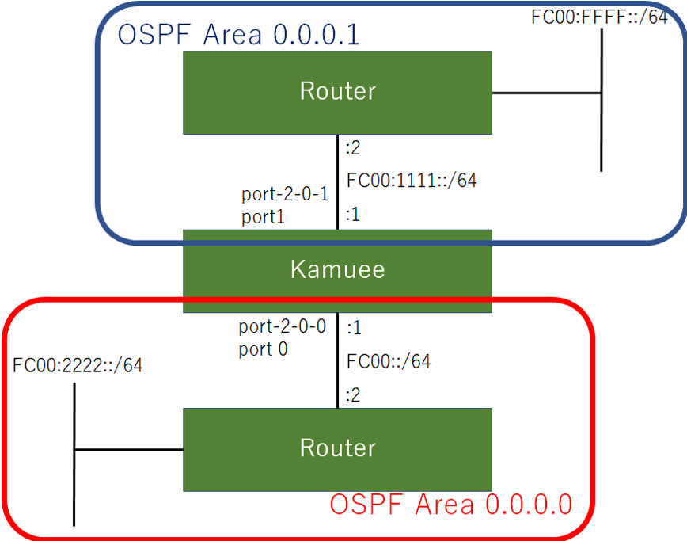

OSPFv3 Configuration
=====================

コマンド概要
------------

.. code-block:: text

  kamuee@kamuee:~$ vi  /config/quagga/daemons                         #1. ospf6dを有効にして、OSPF6を利用可能にします
  ospf6d=yes                                                          #以下の部分を書き換えた後、Quaggaを再起動する
  kamuee@kamuee:~$ system_quagga_ctrl.sh restart                      #2. Quaggaを再起動します
  kamuee@kamuee:~$ telnet localhost ospf6d                            #3. ospf6dのコンソールにTelnet接続します

  User Access Verification

  Password:zebra
  ospf6d@kamuee> enable                                               #4. ospf6dのコンソールを特権モードに切り替えます
  Password:zebra
  ospf6d@kamuee# configure terminal                                   #5. ospf6dのコンソールをグローバルコンフィグモードに切り替えます
  ospf6d@kamuee(config)# router ospf6                                 #6. ospf6dのコンソールをルータコンフィグモードに切り替えます
  ospf6d@kamuee(config-ospf6)# router-id 1.1.1.1                      #7. OSPF6のルータIDを1.1.1.1に設定します
  ospf6d@kamuee(config-ospf6)# interface port-2-0-0 area 0.0.0.0      #8. 物理ポートport-2-0-0へ、OSPF6をエリア0.0.0.0で設定します
  ospfd@kamuee(config-if)# ip ospf mtu-ignore                         #9. ネイバーとMTUが一致していない場合でも、OSPFネイバー関係を結ぶよう設定します
  ospf6d@kamuee# exit                                                 #10. ospf6dでひとつ前のモードに戻します。または、ospf6dのコンソールのTelnet接続を終了します
  ospf6d@kamuee# write memory                                         #11. ospf6dで現在実行中のコンフィグを保存します
  ospf6d@kamuee# show running-config                                  #12. ospf6dで現在実行中のコンフィグを表示します
  ospf6d@kamuee# show ip ospf neighbor                                #13. ospf6dでOSPFのネイバーを表示します
  ospf6d@kamuee# show ip ospf database                                #14. ospf6dでOSPFデータベースを表示します
  zebra@kamuee# show ip route                                         #15. Zebraのルーティングテーブルを表示します
  kamuee-vty[0]> show ipv4 route                                      #16. Kamueeのルーティングテーブルを表示します

OSPF6設定例
-----------

図のようなネットワークに、OSPF6を設定する。
KamueeのルータIDを1.1.1.1、Port 0をエリア0.0.0.0、
Port 1をエリア0.0.0.1に設定する

設定コマンド

.. code-block:: text

  zebra@kamuee(config)# interface port-2-0-0
  zebra@kamuee(config-if)# ipv6 address fc00::1/64
  zebra@kamuee(config-if)# interface port-2-0-1
  zebra@kamuee(config-if)# ipv6 address fc00:1111::1/64

  kamuee@kamuee:~$ telnet localhost ospf6d
  Trying ::1...
  Connected to localhost.
  Escape character is '^]'.

  Hello, this is Quagga (version 0.99.24.1).
  Copyright 1996-2005 Kunihiro Ishiguro, et al.

  User Access Verification

  Password:zebra
  ospf6d@kamuee> enable
  Password:zebra
  ospf6d@kamuee# configure terminal
  ospf6d@kamuee(config)# router ospf6
  ospf6d@kamuee(config-ospf6)# router-id 1.1.1.1
  ospf6d@kamuee(config-ospf6)# interface port-2-0-0 area 0.0.0.0
  ospf6d@kamuee(config-ospf6)# interface port-2-0-1 area 0.0.0.1
  ospf6d@kamuee(config-ospf6)# exit
  ospf6d@kamuee(config)# exit
  ospf6d@kamuee#
  確認コマンド
  ospf6d@kamuee# show running-config

  Current configuration:
  !
  hostname ospf6d@kamuee
  password zebra
  enable password zebra
  !
  !
  interface port-2-0-0
   ipv6 ospf6 network broadcast
  !
  interface port-2-0-1
   ipv6 ospf6 network broadcast
  !
  router ospf6
   router-id 1.1.1.1
   interface port-2-0-0 area 0.0.0.0
   interface port-2-0-1 area 0.0.0.1
  !
  line vty
  !
  end
  ospf6d@kamuee# show ipv6 ospf6 neighbor
  Neighbor ID     Pri    DeadTime  State/IfState         Duration I/F[State]
  172.16.16.1       1    00:00:38   Full/DR              00:00:09 port-2-0-0[BDR]
  172.16.254.1      1    00:00:35   Full/DR              00:00:08 port-2-0-1[BDR]
  ospf6d@kamuee# show ipv6 ospf6 database

          Area Scoped Link State Database (Area 0.0.0.0)

  Type LSId           AdvRouter       Age   SeqNum                        Payload
  Rtr  0.0.0.0        1.1.1.1          64 80000005          172.16.16.1/0.0.3.249
  Rtr  0.0.0.0        172.16.16.1      59 80000154          172.16.16.1/0.0.3.249
  Net  0.0.3.249      172.16.16.1     528 80000001                    172.16.16.1
  Net  0.0.3.249      172.16.16.1     528 80000001                        1.1.1.1
  IAP  0.0.0.4        1.1.1.1          68 80000001                 fc00:1111::/64
  IAP  0.0.0.5        1.1.1.1          63 80000001                 fc00:ff::1/128
  IAP  0.0.0.6        1.1.1.1          63 80000001               fc00:ffff::1/128
  INP  0.0.0.0        172.16.16.1     528 80000139               fc00:2222::1/128
  INP  0.15.228.0     172.16.16.1     528 80000001                      fc00::/64

          Area Scoped Link State Database (Area 0.0.0.1)

  Type LSId           AdvRouter       Age   SeqNum                        Payload
  Rtr  0.0.0.0        1.1.1.1          63 80000004           172.16.254.1/0.0.0.2
  Rtr  0.0.0.0        172.16.254.1     68 80000004           172.16.254.1/0.0.0.2
  Net  0.0.0.2        172.16.254.1     69 80000001                   172.16.254.1
  Net  0.0.0.2        172.16.254.1     69 80000001                        1.1.1.1
  IAP  0.0.0.1        1.1.1.1          68 80000001                      fc00::/64
  IAP  0.0.0.3        1.1.1.1          64 80000001               fc00:2222::1/128
  INP  0.0.0.0        172.16.254.1    100 80000003                 fc00:ff::1/128
  INP  0.0.0.0        172.16.254.1    100 80000003               fc00:ffff::1/128
  INP  0.0.8.0        172.16.254.1     69 80000001                 fc00:1111::/64

          I/F Scoped Link State Database (I/F port-2-0-0 in Area 0.0.0.0)

  Type LSId           AdvRouter       Age   SeqNum                        Payload
  Lnk  0.0.0.6        1.1.1.1          69 80000001      fe80::9c6f:d0ff:fe36:f4ea
  Lnk  0.0.3.249      172.16.16.1     597 80000005      fe80::8a1d:fcff:fea8:d4c4

          I/F Scoped Link State Database (I/F port-2-0-1 in Area 0.0.0.1)

  Type LSId           AdvRouter       Age   SeqNum                        Payload
  Lnk  0.0.0.7        1.1.1.1          68 80000001      fe80::a896:22ff:fefa:32b9
  Lnk  0.0.0.2        172.16.254.1    126 80000001        fe80::207:eff:fe4c:e52e

          AS Scoped Link State Database

  Type LSId           AdvRouter       Age   SeqNum                        Payload

  ospf6d@kamuee#

  zebra@kamuee# show ipv6 route
  Codes: K - kernel route, C - connected, S - static, R - RIPng,
         O - OSPFv6, I - IS-IS, B - BGP, A - Babel,
         > - selected route, * - FIB route

  C>* ::1/128 is directly connected, lo
  O   fc00::/64 [110/10] is directly connected, port-2-0-0, 00:01:50
  C>* fc00::/64 is directly connected, port-2-0-0
  O>* fc00:ff::1/128 [110/10] via fe80::207:eff:fe4c:e52e, port-2-0-1, 00:01:49
  O   fc00:1111::/64 [110/10] is directly connected, port-2-0-1, 00:01:49
  C>* fc00:1111::/64 is directly connected, port-2-0-1
  O>* fc00:2222::1/128 [110/10] via fe80::8a1d:fcff:fea8:d4c4, port-2-0-0, 00:01:50
  O>* fc00:ffff::1/128 [110/10] via fe80::207:eff:fe4c:e52e, port-2-0-1, 00:01:49
  C * fe80::/64 is directly connected, port-2-0-1
  C * fe80::/64 is directly connected, port-2-0-0
  zebra@kamuee#

  kamuee-vty[0]> show ipv6 route
  ::1/128 local port: 255
  fc00::/64 nexthop-index: 0 fe80::207:eff:fe4c:e52e port: 0 flags: CONNECT
  fc00::1/128 local port: 255
  fc00:ff::1/128 nexthop-index: 0 fe80::207:eff:fe4c:e52e port: 1 flags:
  fc00:1111::1/128 local port: 255
  fc00:2222::1/128 nexthop-index: 1 fe80::8a1d:fcff:fea8:d4c4 port: 0 flags:
  fc00:ffff::1/128 nexthop-index: 0 fe80::207:eff:fe4c:e52e port: 1 flags:
  fe80::207:eff:fe4c:e52e/128 ether: 00:07:0e:4c:e5:2e port: 1
  fe80::8a1d:fcff:fea8:d4c4/128 ether: 88:1d:fc:a8:d4:c4 port: 0
  fe80::9c6f:d0ff:fe36:f4ea/128 local port: 255
  fe80::a896:22ff:fefa:32b9/128 local port: 255
  kamuee-vty[0]>

解説

OSPF6を利用するには、ospf6dを起動する必要があります。
ospf6dを起動するには、/config/quagga/daemonsの以下の太字の部分をyesにして、
Quaggaを再起動します。

.. code-block:: text

  # This file tells the quagga package which daemons to start.
  #
  # Entries are in the format: <daemon>=(yes|no|priority)
  #   0, "no"  = disabled
  #   1, "yes" = highest priority
  #   2 .. 10  = lower priorities
  # Read /usr/share/doc/quagga/README.Debian for details.
  #
  # Sample configurations for these daemons can be found in
  # /usr/share/doc/quagga/examples/.
  #
  # ATTENTION:
  #
  # When activation a daemon at the first time, a config file, even if it is
  # empty, has to be present *and* be owned by the user and group "quagga", else
  # the daemon will not be started by /etc/init.d/quagga. The permissions should
  # be u=rw,g=r,o=.
  # When using "vtysh" such a config file is also needed. It should be owned by
  # group "quaggavty" and set to ug=rw,o= though. Check /etc/pam.d/quagga, too.
  #
  # The watchquagga daemon is always started. Per default in monitoring-only but
  # that can be changed via /etc/quagga/debian.conf.
  #
  zebra=yes
  bgpd=no
  ospfd=no
  ospf6d=yes
  ripd=no
  ripngd=no
  isisd=no
  babeld=no

ospf6dからCiscoルータライクなコマンドを使用して、OSPF6を設定できます。
Zebraのデフォルトのパスワードは、zebraです。

OSPF6は、IPv4アドレスが指定されていない限り、router-idコマンドを使用して、
ルータIDを指定する必要があります。また、ポートでOSPF6を有効にするには、
ルータコンフィグモードからinterfaceコマンドを使用して、
OSPF6を有効にするポートとエリア番号を設定します。

ネイバーとMTU（Maximum Tranfer Unit）が異なる場合、
OSPFネイバー関係を結ぶことができません。
これは、OSPF データベース記述子（DBD）内にインターフェイスMTUが入っているためです。
この現象を回避するには、ネイバーとMTU値を同一に設定します。
または、以下のコマンドを使用して、MTUが不一致だった場合でも無視するように設定します。
（以下の例は、ネイバーがport-2-0-0の先につながっている場合）

.. code-block:: text

  interface port-2-0-0
   ipv6 ospf6 mtu-ignore

OSPF6ネイバーテーブルやOSPF6データベースなど、
OSPF6に関連するステータスは、ospf6dから確認します。
ルーティングテーブルは、ZebraとKamueeから確認します。

ospf6d起動時に自動的に読み込む設定は、write memoryコマンドで保存できます。
Zebraのwrite memoryコマンドはZebraの設定のみを保存します。
同様に、ospf6dのwrite memoryコマンドはospfdの設定のみを保存します。
これは、Zebraとospf6dとは設定が別々になっているためです。

