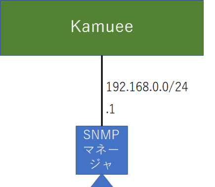

SNMP Config
===========

コマンド概要
------------

.. code-block:: text

  #1. IP アドレス 192.168.0.1 の SNMP マネージャから、
  #   コミュニティ名 public で SNMP による値取得を許可します
  #   以下の部分を追記した後、SNMPデーモンを再起動する
  #   rocommunity public 192.168.0.1
  kamuee@kamuee:~$ vi /config/snmp/snmpd.conf

  #2. IP アドレス 192.168.0.1 の SNMP マネージャへ
  #    コミュニティ名 public、バージ ョン v2c で SNMP Trap を送信します
  #    以下の部分を追記した後、SNMPデーモンを再起動する
  #    trap2sink 192.168.0.1 public
  kamuee@kamuee:~$ vi /config/snmp/snmpd.conf

  kamuee@kamuee:/$ system_snmpd_ctrl.sh restart #3. SNMP デーモンを再起動します。
  kamuee-vty[0]> set snmp enable                #4. Kamuee の SNMP を有効にします。

  # 5. Zebra,ospfd,ospf6d,bgpd の SNMP を有効にします。
  zebra@kamuee(config)# agentx
  ospfd@kamuee(config)# agentx
  ospf6d@kamuee(config)# agentx
  bgpd@kamuee(config)# agentx

  # 9.  SNMP を利用して、自身のホスト名を取得します
  kamuee@kamuee:/$ snmpwalk -v 2c -c public 127.0.0.1 1.3.6.1.2.1.1.5.0

Syslog設定例
------------

IP アドレス 192.168.0.1 の SNMP マネージャに、コミュニティ名 public
での値取得を許可し、コミュニティ名 Public で SNMP Trap を送信する。
なお、SNMP のバージョンは v2c を使用する。

設定コマンド

.. code-block:: text

  kamuee@kamuee:~$ vi /config/snmp/snmpd.conf (以下のエントリを追加)
  rocommunity secret 192.168.0.1
  trap2sink 192.168.0.1 public kamuee@kamuee:~$ system_snmpd_ctrl.sh restart
  kamuee-vty[0]> set snmp enable

確認コマンド
注:SNMP 設定を確認するコマンドはありません

解説
Kamuee システムは、SNMP デーモンが SNMP エージェントの役割を果たします。
SNMP デーモンの設定ファイルは、/config/snmp/snmpd.conf です。
IP アドレス 192.168.0.1 の SNMP マネージャからの SNMP Get 命令を受信し、
SNMP Trap を送信するには、まず、/config/snmp/snmpd.conf に以下の太字の部分を追記しま す。

.. code-block:: text

  ###############################################################################
  #
  # EXAMPLE.conf:
  #   An example configuration file for configuring the Net-SNMP agent ('snmpd')
  #   See the 'snmpd.conf(5)' man page for details
  #
  #  Some entries are deliberately commented out, and will need to be explicitly activated
  #

  （中略）

  ###############################################################################
  #
  #  ACCESS CONTROL
  #
  #  system + hrSystem groups only
  view   systemonly  included   .1.3.6.1.2.1.1
  view   systemonly  included   .1.3.6.1.2.1.25.1

  #  Full access from the local host
  #rocommunity public  localhost
  #  Default access to basic system info
  rocommunity public  default    -V systemonly
  #  rocommunity6 is for IPv6
  rocommunity6 public  default   -V systemonly

  #  Full access from an example network
  #     Adjust this network address to match your local
  #     settings, change the community string,
  #     and check the 'agentAddress' setting above
  #rocommunity secret  10.0.0.0/16
  rocommunity secret  192.168.0.1 ##<----

  #  Full read-only access for SNMPv3
  rouser   authOnlyUser
  #  Full write access for encrypted requests
  #     Remember to activate the 'createUser' lines above
  #rwuser   authPrivUser   priv

  #  It's no longer typically necessary to use the full 'com2sec/group/access' configuration
  #  r[ow]user and r[ow]community, together with suitable views, should cover most requirements

  （中略）

  ###############################################################################
  #
  #  ACTIVE MONITORING
  #
  #   send SNMPv1  traps
  trapsink     localhost public
  #   send SNMPv2c traps
  #trap2sink    localhost public
  trap2sink    192.168.99.16 public  ##<----
  #   send SNMPv2c INFORMs
  #informsink   localhost public

  （中略）

  #
  #  AgentX Sub-agents
  #
  #  Run as an AgentX master agent
  master          agentx
  agentXSocket    /var/run/agentx/master
  #  Listen for network connections (from localhost)
  #    rather than the default named socket /var/agentx/master
  #agentXSocket    tcp:localhost:705

次に、SNMPデーモンを再起動します。コマンドは、system_snmpd_ctrl.sh rest
artです。これで、KamueeのLinuxシステムに関連する値の取得や、SNMP Trap送信が可
能になります。 KamueeでSNMPを有効にしないと、物理ポートに関連する値を取得できません。
KamueeでSNMPを有効にするには、Kamueeからset snmp enableコマンドを使用して
、IF-MIBのifNumber、ifTable、ifXTableに情報をエクスポートするよう設定し
ます。 ルーティングに関連する値を取得するには、Zebra、ospfd、ospf6dまたはbgpdで
agentxコマンドを使用して、SNMPを有効にします。Zebraからagentxコマンドを使用する
と、IP−FORWARD-MIBに情報をエクスポートします。ospfdからagentxコマンドを使用
すると、OSPF-MIBに情報をエクスポートします。ospf6dからagentxコマンドを使用すると
、OSPFv3-MIBに情報をエクスポートします。bgpdからagentxコマンドを使用すると、BG
P-MIBに情報をエクスポートします。agentxコマンドでSNMPを一旦有効にすると、no age
ntxコマンド等でSNMPを無効にすることはできません。 SNMPの動作を確認するには、
snmpwalk コマンドを使用して、正常に値が取得できることを確認します。

