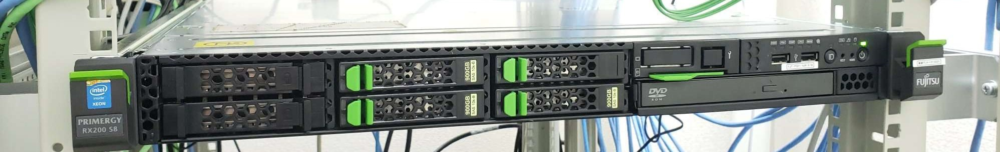
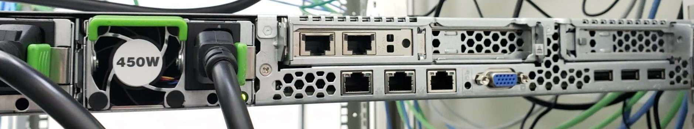
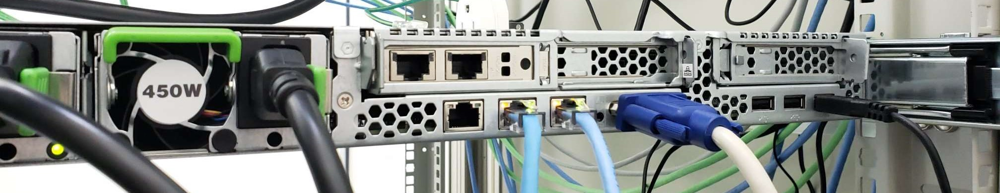

.. icon 用ラベルの読み込み
.. include:: def_icon.txt

アプライアンス製品例
======================================================

設置と配線
---------------------
　
　 :numref:`tblhard` は、kamuee を動作させるハードウエアの構成例です。本稿では :numref:`tblhard` で示すハードウエアを例として設定方法を解説します。

.. list-table:: ハードウエア構成例
   :name: tblhard
   :widths: 12 30 28
   :header-rows: 1
   :stub-columns: 1

   * - 名称
     - 機種・型番
     - 備考
   * - 筐体
     - FUJITSU PRIMERGY RX200 S8/D3302-A1
     - 1U （高さx幅x奥行 = 4.3 cm x 43.11 cm x 76.88 cm）
   * - CPU
     - Intel(R) Xeon(R) CPU E5-2620 v2
     - 2.10GHz 6 コア 12 スレッド
   * - メモリ
     -
     - 32 GB
   * - ストレージ
     -
     - 800 GB
   * - ネットワークインターフェース（内蔵インターフェース）
     - Intel(R) I350 Gigabit Network Connection 1521
     - 1 Giga bit インターフェース x 2
   * - ネットワークインターフェース（PCIスロット 1）
     - Intel(R) 10G X550T 1563
     - 10 Giga bit インターフェース x 2
   * - 管理用 リモートコンソールポート
     - iRMC
     -

    kamuee ハードウエア（前面）

    kamuee ハードウエア（背面）

.. figure:: ./images/kamuee-back-port.eps
    :name: kamuee-port
    :scale: 50
    :align: center

    kamuee ハードウエア例の背面側ポート構成

　:numref:`kamuee-front00` と :numref:`kamuee-back00` は :numref:`tblhard` で示すハードウエアの前面と背面の写真です。
:numref:`kamuee-port` は :numref:`kamuee-back00` のポート構成を図にしたものです。:numref:`kamuee-port` の内容を :numref:`tblport` にまとめます。

.. list-table:: ポート構成
   :name: tblport
   :widths: 12 30 28
   :header-rows: 1
   :stub-columns: 1

   * - ポート名
     - 説明
     - 備考
   * - iRMC
     - リモートコンソール専用ポート
     - BIOSでIPアドレス設定が必要
   * - eno1
     - 1Gbps ネットワークインターフェース（内蔵）
     - 予備
   * - eno2
     - 1Gbps ネットワークインターフェース（内蔵）
     - 管理用ポート
   * - enp2s0f0
     - 10G-T ネットワークインターフェース（PCIスロット 2）
     - パケット転送ポート用
   * - enp2s0f1
     - 10G-T ネットワークインターフェース（PCIスロット 2）
     - パケット転送ポート用

**iRMC** は機器に内蔵されたリモートコンソール専用ポートで、BIOSでIPアドレスを設定することで利用できます。
**eno1** は予備ポートとします。
**eno2** は kaemuee 管理用の SSH ログイン用ポートとし DHCP の設定を行います。
**enp2s0f0** と **enp2s0f1** はパケット転送用ポートとして設定します。

　ラックマウント後 :numref:`kamuee-back01` のように、**iRMC** 、 **eno2** にUTPを配線し、管理用のネットワークに接続します。
また、初期設定をサーバから直接行う場合、 VGA にモニタを接続し、USB ポートに USB キーボードを接続して下さい。

    kamuee サーバ（配線後）

    |ic02| |la02|
    USBキーボードの種類によっては、認識されないことがあります。その際には別のキーボードを利用してください。（試験環境では Lenovo の トラックポイント付き USB キーボードが利用できませんでした。）

起動とログイン
------------------

　電源投入後、モニターにベースOSであるUbuntuのログイン画面が確認できます。初期アカウントとパスワードを入力してログインしてください。
アカウント情報を次の :numref:`tblaccount` に示します。

.. list-table:: 初期アカウント
   :name: tblaccount
   :widths: 12 30 28
   :header-rows: 1
   :stub-columns: 1

   * - アカウント名
     - 権限
     - パスワード
   * - kamuee
     - wheel
     - kamuee

|ic02| |la02|
    パスワードはログイン後に必ず変更してください。初期パスワードのままで運用することは潜在的なセキュリティホールになる可能性があります。

管理用ポートのIPアドレス設定
-------------------------------
　kamuee では、ルータのパケット転送に利用するポートは別途、占有することを指定します。占有指定していない場合には通常の Ubuntu で利用できる NIC として利用できます。本節では通常の Ubuntu NIC 設定について説明しますので、既知の場合には読み飛ばしてください。
　デフォルトでは、管理用ポートとして設定したいポートに **netplan** 経由で DHCP を設定し、SSHログインなどに利用できます。
管理用ポートをネットワークに接続後、 **ip addr** コマンドで割当られたDHCPアドレスを確認します。

|ic01| |la01|
    **netplan** の設定ファイルは **/etc/netplan/01-netcfg.yaml** に配置されています。
    次の例では、**eno2** にDHCPv4 を設定しています。

    ::

        # This file describes the network interfaces available on your system
        # For more information, see netplan(5).
        network:
          version: 2
          renderer: networkd
          ethernets:
            eno2:
          dhcp4: yes

    ..

    固定IPを割り当てる場合は、**/etc/netplan/01-netcfg.yaml** を次のような形で編集します。

    ::

        network:
          version: 2
          renderer: networkd
          ethernets:
            eno2:
              dhcp4: no
              addresses: [10.0.2.100/24]
              gateway4: 10.0.2.1
              nameservers:
                addresses: [10.0.2.1]

    ..

    編集後、**sudo netplan apply** コマンドを実行して適用します。

    ::

        sudo netplan apply

    ..

    設定の確認は **ip addr** コマンドで行います。

    |ic03| NTTCOM　TODO
     インストール済みサーバを出荷する場合、

    * eno2を常にmgmtにする
    * 可変にしておき裏にテプララベルで「kamuee-mgmt」と貼ったポートがSSH有効ポートですとマニュアルに書く

    など考えられます。

　ssh はデフォルトで有効になっています。ssh が起動していない場合は、下記のコマンドを実行してください。

    ::

        sudo systemctl enable ssh
        sudo systemctl start ssh

    ..

kamuee で使用するポート割り当て
-------------------------------------

　kamueeで高速パケット転送を行うため、ネットワークインターフェイスをDPDKに登録します（kamueeで利用するよう占有指定します）。
:numref:`tblhard` のハードウエア構成の場合、 インターフェース名とそのPCI番号が :numref:`tblportpci` のようになるとします。

.. list-table:: インターフェース名とPCI番号
   :name: tblportpci
   :widths: 12 30 28
   :header-rows: 1
   :stub-columns: 1

   * - インターフェース名
     - スピード
     - PCI番号
   * - eno1
     - 1G
     - 0000:07:00.0
   * - eno2
     - 1G
     - 0000:07:00.1
   * - enp2s0f0
     - 10G/5G/2.5G/1G/100M
     - 0000:02:00.0
   * - enp2s0f1
     - 10G/5G/2.5G/1G/100M
     - 0000:02:00.1

　ここで、10G インターフェースの enp2s0f0 と enp2s0f1 をポートとして設定して、kamuee で管理するとします。
このとき、次のコマンドを実行して、DPDKの設定を行い、kamuee を **systemctl** コマンドで再起動します。

    ::

        kamuee@kamuee:~$ sudo /usr/local/share/dpdk/usertools/dpdk-devbind.py -b igb_uio 0000:02:00.0
        kamuee@kamuee:~$ sudo /usr/local/share/dpdk/usertools/dpdk-devbind.py -b igb_uio 0000:02:00.1
        kamuee@kamuee:~$ sudo systemctl restart kamuee

    ..

　実行後、**ip link** コマンドで確認すると、DPDKを設定したインターフェースは **port-2-0-1** のように **port-PCI番号** にリネームされてます。

    ::

        kamuee@kamuee:~$ ip link
        1: lo: <LOOPBACK,UP,LOWER_UP> mtu 65536 qdisc noqueue state UNKNOWN mode DEFAULT group default qlen 1000
            link/loopback 00:00:00:00:00:00 brd 00:00:00:00:00:00
        3: eno1: <BROADCAST,MULTICAST> mtu 1500 qdisc noop state DOWN mode DEFAULT group default qlen 1000
            link/ether 70:e2:84:09:f1:0c brd ff:ff:ff:ff:ff:ff
        4: eno2: <BROADCAST,MULTICAST,UP,LOWER_UP> mtu 1500 qdisc mq state UP mode DEFAULT group default qlen 1000
            link/ether 70:e2:84:09:f1:0d brd ff:ff:ff:ff:ff:ff
        6: port-2-0-0: <BROADCAST,MULTICAST> mtu 1500 qdisc noop state DOWN mode DEFAULT group default qlen 1000
            link/ether a0:36:9f:ba:3b:9c brd ff:ff:ff:ff:ff:ff
        7: port-2-0-1: <BROADCAST,MULTICAST> mtu 1500 qdisc noop state DOWN mode DEFAULT group default qlen 1000
            link/ether a0:36:9f:ba:3b:9d brd ff:ff:ff:ff:ff:ff

    ..

    |ic01| |la01|

    インターフェースのPCI番号はハードウエア構成により変わります。PCI番号は **dmesg** コマンドで確認できます。次は該当箇所の出力例です。

    ::

        [   19.618978] ixgbe 0000:02:00.0: PCI Express bandwidth of 32GT/s available
        [   19.718017] ixgbe 0000:02:00.0: (Speed:8.0GT/s, Width: x4, Encoding Loss:<2%)
        [   19.931708] ixgbe 0000:02:00.0: MAC: 4, PHY: 0, PBA No: H86377-005
        [   20.033443] ixgbe 0000:02:00.0: a0:36:9f:ba:3b:9c
        [   20.296453] ixgbe 0000:02:00.0: Intel(R) 10 Gigabit Network Connection
        [   21.096840] ixgbe 0000:02:00.1: Multiqueue Enabled: Rx Queue count = 24, Tx Queue count = 24 XDP Queue count = 0

    ..

    |ic03| NTTOM　TODO

    アプライアンスとしてインストール済みサーバを販売する場合、
    出荷に合わせて、dpdk-devbind.py を実行する Shellスクリプトファイルの設定を追記してください。
    （リブートするとDPDKの設定が消えてしまう）

ポートの確認とCPU割り当て
-------------------------------

　2.4 節での kamuee へのポート割当が正しく実施されているかを確認するには、 **show port** コマンドを実行します。

    ::

        kamuee[vty0]> show port
        port        id c if tap mac-addr          drvr   speed supported
        port-2-0-0   0 0  0   6 A0:36:9F:BA:3B:9C ixgbe      0 10G/5G/2.5G/1G/100M
        port-2-0-1   1 0  0   7 A0:36:9F:BA:3B:9D ixgbe      0 10G/5G/2.5G/1G/100M
        kamuee[vty0]>

    ..

特定のポートの詳細を確認するには **show port** コマンドでポートのIDを指定します。

    ::

        kamuee[vty0]> show port 1
        port1:
            new name: kni-2-0-1
            valid: 1
            vrf: 0 (vrf0)
            flags: <RUNNING|CHANGED|OURS-TAP>
            kni ifindex: -1
            tap ifindex: 7
            tap name: port-2-0-1
            tap sockfd: 119
            promiscuous:       1    allmulticast:      1
            nrxq:              4    ntxq:             24
            hwaddr: A0:36:9F:BA:3B:9D
            （割愛）

    ..

全ポートの詳細を確認するには **show port all** コマンドを実行します。

    ::

        kamuee[vty0]> show port all
        port0:
            new name: kni-2-0-0
            valid: 1
            vrf: 0 (vrf0)
            flags: <RUNNING|OURS-TAP>
            kni ifindex: -1
            tap ifindex: 6
            tap name: port-2-0-0
            tap sockfd: 118
            promiscuous:       1    allmulticast:      1
            nrxq:              4    ntxq:             24
            hwaddr: A0:36:9F:BA:3B:9C
            device info:

            （割愛）

    ..

　kamuee では、CPUスレッドをポートの rx-queue に割り当てる必要があります。
現在の割り当て状態を確認する場合は、次のように **show thread info** コマンドを実行してください。

    ::

		kamuee[vty0]> show thread info
		core[id]: v thread name        lcpu pcpu port  rxq funcp
		core[0]:  1 (null)                0    0    0    0 (nil)
		core[1]:  1 OS                    0   --   --   -- (nil)
		core[2]:  1 lthread_scheduler     0   --   --   -- 0x56490aab7840
		core[3]:  1 forwarder             0   --   --   -- 0x56490a9da540
		core[4]:  1 forwarder             0    0    0    0 0x56490a9da540
		core[5]:  1 forwarder             0    0    0    1 0x56490a9da540
		core[6]:  1 rib_manager           1   --   --   -- 0x56490a9b1640
		core[7]:  1 tap_manager           1   --   --   -- 0x56490aa4ca50
		core[8]:  1 forwarder             1    0    0    2 0x56490a9da540
		core[9]:  1 forwarder             1    0    0    3 0x56490a9da540
		core[10]: 1 forwarder             1    0    1    0 0x56490a9da540
		core[11]: 1 forwarder             1    0    1    1 0x56490a9da540
		core[12]: 1 forwarder             0    0    1    2 0x56490a9da540
		core[13]: 1 forwarder             0    0    1    3 0x56490a9da540
		core[14]: 1 forwarder             0   --   --   -- 0x56490a9da540
		core[15]: 1 forwarder             0   --   --   -- 0x56490a9da540
		core[16]: 1 forwarder             0   --   --   -- 0x56490a9da540
		core[17]: 1 forwarder             0   --   --   -- 0x56490a9da540
		core[18]: 1 forwarder             1   --   --   -- 0x56490a9da540
		core[19]: 1 forwarder             1   --   --   -- 0x56490a9da540
		core[20]: 1 forwarder             1   --   --   -- 0x56490a9da540
		core[21]: 1 forwarder             1   --   --   -- 0x56490a9da540
		core[22]: 1 OS                    1   --   --   -- (nil)
		core[23]: 1 OS                    1   --   --   -- (nil)
		kamuee[vty0]>

    ..

　ポートにCPUスレッドが割り当たっていない場合は、 **set port** コマンドを実行します。
CPUスレッドは ポートの **nrxq** の数だけ割り当てることができます。
次の例では、ポート 0 番の rx-queue 0 番から 3 番に対して論理 CPU 4 番から 7 番を割り当てる場合のコマンドです。

    ::

        kamuee-vty[0]> set port 0 rx-queue 0 lcore 4
        kamuee-vty[0]> set port 0 rx-queue 1 lcore 5
        kamuee-vty[0]> set port 0 rx-queue 2 lcore 6
        kamuee-vty[0]> set port 0 rx-queue 3 lcore 7

    ..

|ic04| |la04|

    CPUスレッドの割り当ては、ベースOSや各種マネージャにも割り当てることができます。
    kamuee のCPUスレッド設定は **/etc/kamuee/kamuee.conf** に保存されています。
    起動時にはこの設定ファイルを読み込んで自動的にルーティングの転送設定をDPDKに反映します。
    :numref:`tblhard` のハードウエア構成の場合のサンプル設定を次に示します。

    ::

		set thread 2 lthread_scheduler
		set thread 6 rib_manager
		set thread 7 tap_manager

		set port 0 rx-queue 0 lcore 4
		set port 0 rx-queue 1 lcore 5
		set port 0 rx-queue 2 lcore 8
		set port 0 rx-queue 3 lcore 9
		set port 1 rx-queue 0 lcore 10
		set port 1 rx-queue 1 lcore 11
		set port 1 rx-queue 2 lcore 12
		set port 1 rx-queue 3 lcore 13

    ..

    |ic02| |la02|
    CPUスレッド番号 6 は rib_manager に、CPUスレッド番号 7 は tap_manager に必ず割り当てられます。
    また、rib_manager、tap_manager に他のCPUスレッド番号を割り当てることはできません。

